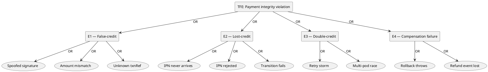

# Backend Design Pattern & Fault Tree Analysis Review

**Project:** SoLi Food Delivery — NestJS Backend
**Source root:** `apps/api/src`
**Methodology:** Code-grounded reverse engineering. Every claim cites an exact file path and verbatim snippet.

---

## 1. Project Architecture Overview

### 1.1 High-level architecture

The backend is a single NestJS application organised as a **modular monolith with bounded contexts (BCs)** that communicate through three disciplined mechanisms:

1. **CQRS commands & events** (`@nestjs/cqrs`) — for write-side workflows and async fan-out.
2. **Ports & Adapters (Hexagonal)** — for cross-BC dependencies (Ordering ↔ Payment, Ordering ↔ Promotion).
3. **Anti-Corruption Layer (ACL) projections** — for read-side data that one BC needs from another (Ordering owns local snapshots of menu items, restaurants, and delivery zones).

### 1.2 Bounded contexts (modules)

| BC                  | Module file                                                                 | Responsibility                                              |
|---------------------|-----------------------------------------------------------------------------|-------------------------------------------------------------|
| Ordering            | [ordering.module.ts](../../src/module/ordering/ordering.module.ts)          | Cart, order placement, lifecycle, history, ACL projections  |
| Restaurant Catalog  | [restaurant-catalog.module.ts](../../src/module/restaurant-catalog/restaurant-catalog.module.ts) | Restaurants, menus, modifiers, search, zones                |
| Payment             | [payment.module.ts](../../src/module/payment/payment.module.ts)             | VNPay integration, payment transactions, IPN handling       |
| Promotion           | [promotion.module.ts](../../src/module/promotion/promotion.module.ts)       | Coupons, promotion pricing engine, reservation saga         |
| Notification        | [notification.module.ts](../../src/module/notification/notification.module.ts) | Multi-channel delivery (email / push / in-app)            |

### 1.3 Major backend flows

- **Place Order:** Cart → idempotency check → distributed lock → ACL validation → server-authoritative pricing → atomic DB transaction → publish `OrderPlacedEvent` → initiate VNPay (if applicable).
- **VNPay IPN:** Signature verify → idempotent terminal-state check → amount validation → optimistic locking update → publish `PaymentConfirmedEvent` / `PaymentFailedEvent`.
- **Order Lifecycle:** Commands routed through `TransitionOrderHandler`, validated against a declarative `TRANSITIONS` map, written atomically with an audit log row, then events fan out to notifications and saga handlers.
- **Reconciliation:** `@Cron` tasks every minute auto-cancel stale orders and time-out abandoned payments using optimistic locking to remain multi-pod safe.

### 1.4 Infrastructure overview

| Concern             | Implementation                                                                                                  |
|---------------------|-----------------------------------------------------------------------------------------------------------------|
| Persistence         | PostgreSQL via Drizzle ORM ([drizzle.module.ts](../../src/drizzle/drizzle.module.ts))                           |
| Cache / locks       | Redis ([redis.service.ts](../../src/lib/redis/redis.service.ts)) — cart storage, idempotency cache, SET NX locks |
| Auth                | BetterAuth ([lib/auth.ts](../../src/lib/auth.ts))                                                               |
| Async messaging     | In-process `EventBus` from `@nestjs/cqrs`                                                                       |
| Scheduling          | `@nestjs/schedule` `@Cron` decorators on timeout reconciliation tasks                                           |
| Payment gateway     | VNPay over HMAC-SHA512 signed redirect + IPN                                                                    |
| Notification        | Nodemailer (email) + Firebase Admin (push) + WebSocket gateway (in-app)                                         |

---

# PART I — DESIGN PATTERN ANALYSIS

## 2. Detected Design Patterns

> Every pattern below is supported by **real source code**. NestJS DI is treated as framework plumbing and is only credited when it is used to express a higher-level architectural intent (e.g. injecting a `Symbol`-keyed port).

---

### 2.1 CQRS (Command Query Responsibility Segregation)

**Purpose.** Separate write-side workflows (Commands) from broadcast notifications (Events) so that complex business operations execute in a single handler, while side-effects fan out asynchronously to many independent listeners.

**Where implemented.**

- Commands & handlers:
  - [place-order.command.ts](../../src/module/ordering/order/commands/place-order.command.ts) + [place-order.handler.ts](../../src/module/ordering/order/commands/place-order.handler.ts)
  - [transition-order.command.ts](../../src/module/ordering/order-lifecycle/commands/transition-order.command.ts) + [transition-order.handler.ts](../../src/module/ordering/order-lifecycle/commands/transition-order.handler.ts)
  - [process-ipn.command.ts](../../src/module/payment/commands/process-ipn.command.ts) + [process-ipn.handler.ts](../../src/module/payment/commands/process-ipn.handler.ts)
- Events (in [shared/events/](../../src/shared/events/)):
  - `OrderPlacedEvent`, `OrderStatusChangedEvent`, `OrderCancelledAfterPaymentEvent`, `OrderReadyForPickupEvent`
  - `PaymentConfirmedEvent`, `PaymentFailedEvent`
  - `RestaurantUpdatedEvent`, `MenuItemUpdatedEvent`, `DeliveryZoneSnapshotUpdatedEvent`
- Event handlers in `module/notification/events/`, `module/ordering/order-lifecycle/events/`, `module/ordering/acl/projections/`, `module/payment/events/`.

**Code evidence — Command Handler signature.**

```ts
// place-order.handler.ts
@Injectable()
@CommandHandler(PlaceOrderCommand)
export class PlaceOrderHandler implements ICommandHandler<PlaceOrderCommand> {
  constructor(
    @Inject(DB_CONNECTION) private readonly db: NodePgDatabase<typeof schema>,
    private readonly cartRepo: CartRedisRepository,
    private readonly menuItemSnapshotRepo: MenuItemSnapshotRepository,
    private readonly restaurantSnapshotRepo: RestaurantSnapshotRepository,
    private readonly deliveryZoneSnapshotRepo: DeliveryZoneSnapshotRepository,
    private readonly appSettingsService: AppSettingsService,
    private readonly redis: RedisService,
    private readonly eventBus: EventBus,
    private readonly geo: GeoService,
    @Inject(PAYMENT_INITIATION_PORT)
    private readonly paymentPort: IPaymentInitiationPort,
    @Inject(PROMOTION_APPLICATION_PORT)
    private readonly promotionPort: IPromotionApplicationPort,
  ) {}
  async execute(command: PlaceOrderCommand): Promise<Order> { /* … */ }
}
```

**Interaction flow.**

```
HTTP POST /orders ──► CommandBus.execute(PlaceOrderCommand)
                                         │
                                         ▼
                              PlaceOrderHandler.execute()
                                         │  (after commit)
                                         ▼
                            EventBus.publish(OrderPlacedEvent)
                                         │
              ┌──────────────────────────┼──────────────────────────┐
              ▼                          ▼                          ▼
  OrderPlacedNotificationHandler   (future analytics)       (future search index)
```

**Why it exists.** The order placement workflow has 13 distinct steps (validation, lock, ACL load, pricing, persistence, payment kick-off). Putting all of it in a controller would be untestable. Wrapping it in a `Command` makes the operation an addressable, transactional unit; wrapping side-effects in `Events` lets new BCs subscribe without touching `PlaceOrderHandler`.

**Engineering value.** Decouples writes from notifications, enables horizontal extension (a new module can subscribe to `OrderPlacedEvent` without modifying ordering code), and makes the order-placement flow trivially testable by mocking the `CommandBus`/`EventBus`.

**Pros / cons.** **+** Strong decoupling, testable in isolation, perfect fit for event-driven extension. **−** In-process EventBus loses events on crash before commit — partly mitigated by publishing only after the DB transaction commits.

**Suitability for assignment.** Excellent. Visible in three commands, nine events, and at least five handlers; lecturer can open any handler file and immediately see the `@CommandHandler` / `@EventsHandler` decorators.

---

### 2.2 Repository Pattern

**Purpose.** Encapsulate persistence concerns behind a class-level abstraction so that services depend on intent (`findById`, `upsert`, `updateStatus`) rather than raw SQL or ORM specifics.

**Where implemented.** 21 repository files; representative examples:

- [order.repository.ts](../../src/module/ordering/order-lifecycle/repositories/order.repository.ts)
- [payment-transaction.repository.ts](../../src/module/payment/repositories/payment-transaction.repository.ts)
- [menu-item-snapshot.repository.ts](../../src/module/ordering/acl/repositories/menu-item-snapshot.repository.ts)
- [cart.redis-repository.ts](../../src/module/ordering/cart/cart.redis-repository.ts) (Redis-backed repo, different storage same contract)
- All `notification/repositories/*.repository.ts`, `promotion/repositories/*.repository.ts`.

**Code evidence — Drizzle-backed repository.**

```ts
// order.repository.ts
@Injectable()
export class OrderRepository {
  constructor(@Inject(DB_CONNECTION) private readonly db: NodePgDatabase<typeof schema>) {}

  async findExpiredPendingOrPaid(): Promise<Order[]> {
    return this.db.select().from(orders).where(
      and(
        inArray(orders.status, ['pending', 'paid']),
        lt(orders.expiresAt, sql`NOW()`),
      ),
    );
  }
}
```

**Code evidence — same contract on Redis.**

`cart.redis-repository.ts` exposes domain-language methods (`getCart`, `saveCart`, `deleteCart`) that hide the `cart:<customerId>` key scheme and 7-day TTL.

**Why it exists.** The system uses two stores (PostgreSQL via Drizzle, Redis via `ioredis`). Wrapping both behind repositories means services never see raw drivers and the storage technology is replaceable.

**Engineering value.** Testability (handlers can be unit-tested with in-memory fakes), uniform error semantics, and a clear seam between domain code and infrastructure.

**Pros / cons.** **+** Uniform across both PostgreSQL and Redis; consistent constructor injection. **−** Mostly thin wrappers — could justify a richer aggregate-oriented design later.

**Suitability for assignment.** Strong but textbook. Best used as a supporting pattern rather than the headline.

---

### 2.3 Strategy Pattern (Notification Channels)

**Purpose.** Allow the same `Notification` to be delivered through interchangeable algorithms (email / push / in-app) selected at runtime.

**Where implemented.**

- Strategy interface: [channel.interface.ts](../../src/module/notification/channels/channel.interface.ts)
- Concrete strategies:
  - [email.channel.service.ts](../../src/module/notification/channels/email/email.channel.service.ts)
  - [push.channel.service.ts](../../src/module/notification/channels/push/push.channel.service.ts)
  - [in-app.channel.service.ts](../../src/module/notification/channels/in-app/in-app.channel.service.ts)
- Context that selects strategies: [channel-dispatcher.service.ts](../../src/module/notification/services/channel-dispatcher.service.ts)
- Nested strategy on the email channel: [email-provider.interface.ts](../../src/module/notification/channels/email/email-provider.interface.ts) with concrete [nodemailer-email.provider.ts](../../src/module/notification/channels/email/nodemailer-email.provider.ts) and [noop-email.provider.ts](../../src/module/notification/channels/email/noop-email.provider.ts).
- Same shape for push: [push-provider.interface.ts](../../src/module/notification/channels/push/push-provider.interface.ts), [firebase-push.provider.ts](../../src/module/notification/channels/push/firebase-push.provider.ts), [stub-push.provider.ts](../../src/module/notification/channels/push/stub-push.provider.ts).

**Code evidence — the strategy contract.**

```ts
// channel.interface.ts
export interface INotificationChannel {
  deliver(notification: Notification, context: DeliveryContext): Promise<DeliveryResult>;
}
```

**Code evidence — one concrete strategy.**

```ts
// email.channel.service.ts
@Injectable()
export class EmailChannelService implements INotificationChannel {
  constructor(
    private readonly emailTemplateService: EmailTemplateService,
    @Inject(EMAIL_PROVIDER) private readonly emailProvider: IEmailProvider,
  ) {}

  async deliver(notification: Notification, context: DeliveryContext): Promise<DeliveryResult> {
    if (!context.email) return { success: false, errorCode: 'NO_RECIPIENT_EMAIL', errorMessage: '…' };
    const { html, text } = this.emailTemplateService.render(notification.title, notification.body);
    try {
      await this.emailProvider.sendMail({ to: context.email, subject: notification.title, html, text });
      return { success: true };
    } catch (err) {
      return { success: false, errorCode: 'SMTP_SEND_ERROR', errorMessage: (err as Error).message };
    }
  }
}
```

**Why it exists.** Channels have very different failure modes (SMTP timeouts, FCM invalid-token errors, WebSocket no-presence). The same orchestration code must handle them uniformly. The nested provider strategy lets the SAME email channel be exercised in tests with `noop-email.provider.ts` instead of real SMTP.

**Engineering value.** Adding SMS or Zalo only requires writing one more `INotificationChannel` implementation and registering it in the module — no orchestration code changes.

**Pros / cons.** **+** Clean Open/Closed Principle compliance, dual-layer (channel and provider) keeps tests fast. **−** Heavy DI ceremony in the module file.

**Suitability for assignment.** Very strong. Three concrete strategies plus a nested second tier — easy to draw, easy to defend.

---

### 2.4 Ports & Adapters (Hexagonal Architecture)

**Purpose.** Apply the Dependency Inversion Principle at the bounded-context boundary so that Ordering does not import Payment or Promotion implementation classes.

**Where implemented.**

- Ports: [payment-initiation.port.ts](../../src/shared/ports/payment-initiation.port.ts), [promotion-application.port.ts](../../src/shared/ports/promotion-application.port.ts)
- Adapters (implementing the ports): [payment.service.ts](../../src/module/payment/services/payment.service.ts), [promotion.service.ts](../../src/module/promotion/services/promotion.service.ts)
- Provider wiring (Symbol-keyed): [payment.module.ts](../../src/module/payment/payment.module.ts), [promotion.module.ts](../../src/module/promotion/promotion.module.ts)
- Consumer: [place-order.handler.ts](../../src/module/ordering/order/commands/place-order.handler.ts)

**Code evidence — Port definition.**

```ts
// shared/ports/payment-initiation.port.ts
export const PAYMENT_INITIATION_PORT = Symbol('PAYMENT_INITIATION_PORT');

export interface IPaymentInitiationPort {
  initiateVNPayPayment(
    orderId: string, customerId: string, amount: number, ipAddr: string,
  ): Promise<{ txnId: string; paymentUrl: string }>;
}
```

**Code evidence — Symbol-bound provider (Adapter wiring).**

```ts
// payment.module.ts
@Global()
@Module({
  providers: [
    PaymentService,
    // …
    { provide: PAYMENT_INITIATION_PORT, useExisting: PaymentService },
  ],
  exports: [PAYMENT_INITIATION_PORT, /* … */],
})
export class PaymentModule {}
```

**Code evidence — Consumer depends only on the interface.**

```ts
// place-order.handler.ts
@Inject(PAYMENT_INITIATION_PORT)
private readonly paymentPort: IPaymentInitiationPort,
@Inject(PROMOTION_APPLICATION_PORT)
private readonly promotionPort: IPromotionApplicationPort,
```

**Why it exists.** Without ports, `PlaceOrderHandler` would `import { PaymentService } from '@/module/payment/...'`, coupling Ordering's compile unit to Payment's internals and creating circular-module risk. The `Symbol` token plus an interface in `shared/ports/` resolves both.

**Engineering value.** The Ordering BC could be extracted into its own service tomorrow with no changes other than swapping the adapter implementation. This is the textbook expression of Dependency Inversion — and it is rare to see it executed this cleanly in a student project.

**Pros / cons.** **+** True DIP, removes circular module risk, mockable in tests. **−** Indirection cost is non-zero — only worthwhile at BC boundaries.

**Suitability for assignment.** **Excellent.** Lecturer-visible evidence: `Symbol`, interface in `shared/ports/`, `@Global` provider, `@Inject(PORT_TOKEN)` consumer — all four ingredients are present.

---

### 2.5 Anti-Corruption Layer (ACL) / Adapter

**Purpose.** Insulate Ordering from Restaurant-Catalog's evolving schema by maintaining local read-model snapshots fed by domain events.

**Where implemented.** [`module/ordering/acl/`](../../src/module/ordering/acl/)

- Projectors: [menu-item.projector.ts](../../src/module/ordering/acl/projections/menu-item.projector.ts), [restaurant-snapshot.projector.ts](../../src/module/ordering/acl/projections/restaurant-snapshot.projector.ts), [delivery-zone-snapshot.projector.ts](../../src/module/ordering/acl/projections/delivery-zone-snapshot.projector.ts)
- Snapshot schemas: [menu-item-snapshot.schema.ts](../../src/module/ordering/acl/schemas/menu-item-snapshot.schema.ts), [restaurant-snapshot.schema.ts](../../src/module/ordering/acl/schemas/restaurant-snapshot.schema.ts), [delivery-zone-snapshot.schema.ts](../../src/module/ordering/acl/schemas/delivery-zone-snapshot.schema.ts)
- Snapshot repositories: same folder
- Parallel ACL in Notification BC: [notification-restaurant-snapshot.projector.ts](../../src/module/notification/acl/notification-restaurant-snapshot.projector.ts)

**Code evidence.**

```ts
// menu-item.projector.ts
@Injectable()
@EventsHandler(MenuItemUpdatedEvent)
export class MenuItemProjector implements IEventHandler<MenuItemUpdatedEvent> {
  async handle(event: MenuItemUpdatedEvent): Promise<void> {
    await this.menuItemSnapshotRepo.upsert({
      menuItemId: event.menuItemId, restaurantId: event.restaurantId,
      name: event.name, price: event.price, status: event.status,
      modifiers: event.modifiers, lastSyncedAt: new Date(),
    });
  }
}
```

**Why it exists.** At checkout, `PlaceOrderHandler` MUST validate menu items, but importing `MenuService` would couple Ordering to Restaurant-Catalog. The projector listens to `MenuItemUpdatedEvent` and writes into a snapshot table owned by Ordering. The checkout handler then reads from its own table only.

**Engineering value.** Lets two BCs evolve independently; checkout is resilient to upstream service downtime because it reads from its own DB.

**Suitability for assignment.** Strong — uncommon to see properly executed by students.

---

### 2.6 State / Transition Table Pattern

**Purpose.** Centralise legal order state transitions and their authorisation rules in a single declarative map rather than scattering `if`/`switch` chains across services.

**Where implemented.**

- Transition table: [transitions.ts](../../src/module/ordering/order-lifecycle/constants/transitions.ts)
- Validator: [transition-order.handler.ts](../../src/module/ordering/order-lifecycle/commands/transition-order.handler.ts)

**Code evidence.**

```ts
// transitions.ts
export const TRANSITIONS: Partial<Record<`${OrderStatus}→${OrderStatus}`, TransitionRule>> = {
  'pending→confirmed':           { allowedRoles: ['restaurant', 'admin'] },
  'pending→paid':                { allowedRoles: ['system'] },
  'pending→cancelled':           { allowedRoles: ['customer','restaurant','admin','system'], requireNote: true },
  'paid→cancelled':              { allowedRoles: ['customer','restaurant','admin','system'], requireNote: true, triggersRefundIfVnpay: true },
  'confirmed→preparing':         { allowedRoles: ['restaurant', 'admin'] },
  'preparing→ready_for_pickup':  { allowedRoles: ['restaurant', 'admin'], triggersReadyForPickup: true },
  'ready_for_pickup→picked_up':  { allowedRoles: ['shipper', 'admin'] },
  'picked_up→delivering':        { allowedRoles: ['shipper', 'admin'] },
  'delivering→delivered':        { allowedRoles: ['shipper', 'admin'] },
  'delivered→refunded':          { allowedRoles: ['admin'], requireNote: true },
  // …
};
```

```ts
// transition-order.handler.ts
const rule = TRANSITIONS[`${order.status}→${toStatus}` as const];
if (!rule) throw new UnprocessableEntityException(`Cannot transition from ${order.status} to ${toStatus}`);
if (!rule.allowedRoles.includes(actorRole)) throw new ForbiddenException(/*…*/);
```

**Why it exists.** Orders have 10+ states and 13+ legal transitions. A hand-written `switch` would be unreadable and error-prone. The declarative map also encodes side-effect flags (`triggersRefundIfVnpay`, `triggersReadyForPickup`) used downstream.

**Engineering value.** Adding a new state edge means adding one row — and every handler that reads `TRANSITIONS` benefits instantly. The same table doubles as runtime documentation.

**Suitability for assignment.** Strong and defensible — particularly the side-effect flags, which show real-world thinking beyond a textbook state pattern.

---

### 2.7 Observer / Event-Driven (the second face of CQRS)

The `@EventsHandler` decorators form an Observer pattern over the in-process `EventBus`. Listed separately because the design philosophy (broadcasting domain events) is distinct from CQRS (commands).

**Concrete observers found.**

| Event                              | Handler file                                                                                                       | Effect                                                       |
|------------------------------------|--------------------------------------------------------------------------------------------------------------------|--------------------------------------------------------------|
| `OrderPlacedEvent`                 | [notification/events/order-placed.handler.ts](../../src/module/notification/events/order-placed.handler.ts)        | Creates customer + restaurant notifications                  |
| `PaymentConfirmedEvent`            | [order-lifecycle/events/payment-confirmed.handler.ts](../../src/module/ordering/order-lifecycle/events/payment-confirmed.handler.ts) | Dispatches `pending → paid` transition                       |
| `PaymentFailedEvent`               | [order-lifecycle/events/payment-failed.handler.ts](../../src/module/ordering/order-lifecycle/events/payment-failed.handler.ts) | Dispatches `pending → cancelled` transition                  |
| `OrderStatusChangedEvent`          | [order-lifecycle/events/promotion-rollback-on-cancellation.handler.ts](../../src/module/ordering/order-lifecycle/events/promotion-rollback-on-cancellation.handler.ts) | Rolls back promotion reservation (saga compensation)         |
| `OrderCancelledAfterPaymentEvent`  | [payment/events/order-cancelled-after-payment.handler.ts](../../src/module/payment/events/order-cancelled-after-payment.handler.ts) | Initiates refund flow                                        |
| `MenuItemUpdatedEvent` (and 2 more)| ACL projectors                                                                                                     | Synchronise local read snapshots                             |

**Saga / compensating transaction evidence.**

```ts
// promotion-rollback-on-cancellation.handler.ts
@EventsHandler(OrderStatusChangedEvent)
export class PromotionRollbackOnCancellationHandler implements IEventHandler<OrderStatusChangedEvent> {
  async handle(event: OrderStatusChangedEvent): Promise<void> {
    if (event.toStatus !== 'cancelled' && event.toStatus !== 'refunded') return;
    await this.promotionPort.rollbackReservations(event.orderId);
  }
}
```

That handler is a textbook **compensating transaction**: an order cancellation triggers a backward action in another BC.

---

### 2.8 Facade

`ChannelDispatcherService` is a thin facade over the three notification strategies and the delivery-log repository. `CartService` is a facade over `CartRedisRepository`, `MenuItemSnapshotRepository`, and the modifier validator. Real but unremarkable — supporting evidence only.

---

### 2.9 Singleton (NestJS default)

Every `@Injectable()` provider has singleton scope by default. Present, but framework-level — **not** evidence of sophisticated design on its own.

---

## 3. Best Design Pattern Candidates — Ranked

| Rank | Pattern                       | Files | Architectural depth | Easy to explain? | Lecturer impact |
|------|-------------------------------|------:|---------------------|------------------|-----------------|
| 1    | **Ports & Adapters (Hexagonal)** | 5+ | Very high — true DIP across BCs | Medium (needs a diagram) | **Very high** |
| 2    | **CQRS (Command + Event)**    | 15+   | High — separates writes from broadcasts | Easy with one flow diagram | **Very high** |
| 3    | **Strategy (Notification Channels)** | 7 | Medium-high — two strategy layers | Very easy | High |
| 4    | **Anti-Corruption Layer**     | 6+    | High — bounded-context isolation | Medium | High |
| 5    | **State / Transition Table**  | 3     | Medium-high — declarative state machine | Very easy | High |
| 6    | **Repository**                | 21    | Medium — uniform across SQL + Redis | Very easy | Medium |
| 7    | **Observer / Event-Driven**   | 14+   | Overlaps with CQRS | Easy | Medium (best bundled with CQRS) |

---

## 4. FINAL RECOMMENDATION — Pattern to Present

### Recommended: **Ports & Adapters (Hexagonal Architecture)** — *with CQRS used as the supporting backdrop.*

#### Why this is the strongest choice

1. **Rare in student projects.** Most submissions stop at Repository + DI. A Symbol-keyed port consumed by `@Inject(SYMBOL)` is a clear signal of professional-level architectural thinking.
2. **All four ingredients are present and visible in one screenful:** the port file ([payment-initiation.port.ts](../../src/shared/ports/payment-initiation.port.ts)), the Symbol token, the `@Global` provider wiring ([payment.module.ts](../../src/module/payment/payment.module.ts) with `useExisting`), and the consumer ([place-order.handler.ts](../../src/module/ordering/order/commands/place-order.handler.ts)).
3. **Bonded directly to a real business outcome:** Ordering must remain independent of Payment to enable independent deployment / future microservice extraction.
4. **Pairs naturally with CQRS, ACL, and Saga** for follow-up questions — the lecturer cannot exhaust the topic in five minutes.

#### How easy is it to explain?

Medium. The audience must understand DIP. Mitigate with one before/after diagram:

- *Before:* `PlaceOrderHandler ─► PaymentService` (concrete coupling, circular module risk).
- *After:* `PlaceOrderHandler ─► IPaymentInitiationPort ◄── PaymentService` (Ordering depends only on the interface).

#### Presentation strategy

1. **Open with the problem.** "Ordering needs Payment and Promotion. A direct import couples two bounded contexts and risks circular dependencies."
2. **Show the port (15 seconds).** Open [payment-initiation.port.ts](../../src/shared/ports/payment-initiation.port.ts) — read the interface aloud.
3. **Show the adapter wiring (15 seconds).** Open [payment.module.ts](../../src/module/payment/payment.module.ts) and point to `{ provide: PAYMENT_INITIATION_PORT, useExisting: PaymentService }`.
4. **Show the consumer (15 seconds).** Open [place-order.handler.ts](../../src/module/ordering/order/commands/place-order.handler.ts) and read the `@Inject(PAYMENT_INITIATION_PORT)` constructor parameter.
5. **Demonstrate the benefit.** "We can swap VNPay for MoMo by writing a new adapter — no code in Ordering changes."
6. **Bridge to CQRS.** "Notice that `paymentPort.initiateVNPayPayment` is invoked from inside a `PlaceOrderHandler` — this command is itself part of our CQRS layer, which is the second pattern in this system."

#### Files to show during defense (in this order)

1. [shared/ports/payment-initiation.port.ts](../../src/shared/ports/payment-initiation.port.ts) — the contract.
2. [shared/ports/promotion-application.port.ts](../../src/shared/ports/promotion-application.port.ts) — proof it generalises.
3. [module/payment/payment.module.ts](../../src/module/payment/payment.module.ts) — the adapter binding.
4. [module/promotion/promotion.module.ts](../../src/module/promotion/promotion.module.ts) — second adapter binding.
5. [module/ordering/order/commands/place-order.handler.ts](../../src/module/ordering/order/commands/place-order.handler.ts) — the consumer.
6. [module/ordering/ordering.module.ts](../../src/module/ordering/ordering.module.ts) — note no `import { PaymentService }`.

#### Suggested diagrams

- **Hexagon diagram.** Ordering BC in the centre. Two ports on the right boundary. Payment + Promotion adapters as external boxes.
- **Sequence diagram.** Customer → Controller → `CommandBus` → `PlaceOrderHandler` → `paymentPort.initiateVNPayPayment()` → `PaymentService.initiateVNPayPayment()`.

#### Talking points to emphasise

- "We use a `Symbol` token, not a string, so two modules can't accidentally collide."
- "Both ports live in `shared/ports/` so neither BC owns the other's interface."
- "The `@Global()` modifier on `PaymentModule` and `PromotionModule` means consumers don't have to re-import — but the dependency is still expressed via the port, not the concrete class."
- "This is the single change that lets us extract Ordering into its own deployment unit later."

---

# PART II — FAULT TREE ANALYSIS

## 5. Candidate Feature + Quality Attribute Pairs

### Pair 1 — VNPay IPN Processing × Integrity

- **Feature.** [`ProcessIpnHandler`](../../src/module/payment/commands/process-ipn.handler.ts) consumes the VNPay IPN callback, the only authoritative path that flips a payment to `completed` / `failed`.
- **Quality attribute.** **Integrity** (specifically: financial integrity — never credit an order without genuine payment, never double-credit on retry).
- **Why suitable.** Five independent failure surfaces: spoofed signature, retry storms, amount tampering, concurrent IPN delivery to multiple pods, and unknown transaction references. The codebase already mitigates all five — the FTA can simultaneously enumerate failures AND show the protections.
- **Code evidence of mitigations.**
  - HMAC-SHA512 signature verification first (`verifyIpn` returns RspCode `97`).
  - Terminal-state idempotency check (RspCode `00` short-circuit).
  - Amount equality check (RspCode `04`).
  - Optimistic locking via the `version` column on `payment_transactions`.
  - `UNIQUE(provider_txn_id)` DB constraint as a hard backstop.

### Pair 2 — Order Placement × Consistency

- **Feature.** [`PlaceOrderHandler`](../../src/module/ordering/order/commands/place-order.handler.ts).
- **Quality attribute.** **Consistency** (no duplicate orders, no stale prices, no orphaned promotion reservations).
- **Why suitable.** Six independent failure surfaces: duplicate retries, concurrent checkouts, stale ACL prices, missing zones, promotion-service downtime, partial DB failure. Mitigations include Redis idempotency cache + DB `UNIQUE(cart_id)` + 30 s `SET NX` lock + server-authoritative pricing + atomic transaction + promotion saga.

### Pair 3 — Order Timeout Reconciliation × Reliability

- **Feature.** [`OrderTimeoutTask`](../../src/module/ordering/order-lifecycle/tasks/order-timeout.task.ts) and [`PaymentTimeoutTask`](../../src/module/payment/tasks/payment-timeout.task.ts) — `@Cron(EVERY_MINUTE)` reconcilers.
- **Quality attribute.** **Reliability** (system self-heals when async signals are lost).
- **Why suitable.** Failure scenarios: cron firing on multiple pods simultaneously, optimistic lock loss, DB query failure, event-publishing failure. Mitigations include optimistic locking and per-iteration `try/catch`.

### Pair 4 — Notification Delivery × Availability

- **Feature.** [`ChannelDispatcherService`](../../src/module/notification/services/channel-dispatcher.service.ts) over three channel strategies.
- **Quality attribute.** **Availability** (graceful degradation when SMTP/FCM/WebSocket fail).
- **Why suitable.** Three independent channels with three different failure modes. Already returns `DeliveryResult` rather than throwing — degradation is intentional.

---

## 6. Best FTA Candidate Ranking

| Rank | Pair                                      | Failure modes | Mitigation depth | Academic interest | Demo evidence |
|------|-------------------------------------------|--------------:|------------------|-------------------|---------------|
| 1    | **VNPay IPN × Integrity**                 | 5+            | Very deep        | Very high (touches security + concurrency + idempotency) | Excellent |
| 2    | Order Placement × Consistency             | 6+            | Very deep        | High              | Excellent |
| 3    | Order/Payment Timeout × Reliability       | 4             | Deep             | Medium-high       | Good |
| 4    | Notification Delivery × Availability      | 3             | Medium           | Medium            | Good |

---

## 7. FINAL FTA RECOMMENDATION

### Feature: **VNPay IPN Processing** ([`ProcessIpnHandler`](../../src/module/payment/commands/process-ipn.handler.ts))

### Quality Attribute: **Integrity** (financial integrity — accuracy and non-repudiation of payment state)

### Why this is the best pair

1. **Real money is involved.** Any failure has a tangible business cost; the lecturer immediately understands the stakes.
2. **It is the richest fault surface in the codebase.** Cryptographic, idempotency, concurrency, validation, and external-service failures all converge here.
3. **The codebase already implements mitigations for every leaf failure.** This converts the FTA from a hypothetical exercise into a real engineering walk-through — much more impressive.
4. **Each mitigation maps to a different software-engineering concept** (HMAC, timing-safe comparison, optimistic locking, idempotency, DB constraints, event-driven compensation). The presentation naturally tours all of them.
5. **Defensible at any depth.** If asked, "What if the DB is down?" — point to `IPN_RSP_UNKNOWN_ERROR` (RspCode `99`) which VNPay retries automatically.

---

## 8. Full Fault Tree Analysis

### 8.1 Top failure event

> **TFE — A payment transaction settles into an incorrect terminal state**
>
> Either: an order is marked `paid` without genuine money received (false-credit), OR the customer paid but the order remains `pending`/`cancelled` (lost-credit), OR the payment is double-credited.

### 8.2 Fault tree structure (canonical form)

```
TFE: Payment integrity violation
│
├── OR ── E1 — False-credit (order shows paid without real payment)
│         │
│         ├── OR ── E1.1 — Spoofed IPN accepted
│         │         ├── AND ── L1.1 — Attacker can craft IPN payload
│         │         │           AND ── L1.2 — Signature check bypassed/weakened
│         │         │
│         │         └── (Mitigation: HMAC-SHA512 + crypto.timingSafeEqual in vnpay.service.ts)
│         │
│         ├── OR ── E1.2 — Amount-tampered IPN accepted
│         │         └── L2 — `vnp_Amount / 100 ≠ txn.amount` not detected
│         │              (Mitigation: explicit `if (ipnAmount !== txn.amount) return RspCode 04`)
│         │
│         └── OR ── E1.3 — IPN for unknown txnRef accepted
│                   └── L3 — `txnRepo.findById(txnRef)` returns null but handler proceeds
│                        (Mitigation: early `if (!txn) return RspCode 01`)
│
├── OR ── E2 — Lost-credit (real payment, order still pending/cancelled)
│         │
│         ├── OR ── E2.1 — IPN never arrives
│         │         ├── L4.1 — VNPay → our server network failure
│         │         └── L4.2 — Our IPN endpoint 5xx response (VNPay stops retrying after `00`)
│         │              (Mitigation 1: PaymentTimeoutTask reconciler @Cron every minute)
│         │              (Mitigation 2: never return `00` on partial failure — return `99`)
│         │
│         ├── OR ── E2.2 — IPN arrives but is rejected by us
│         │         ├── L5.1 — Clock skew / encoding mismatch causes signature mismatch
│         │         └── L5.2 — `buildHashData` divergence from VNPay's PHP reference
│         │              (Mitigation: unit-tested replication of PHP `urlencode` semantics in `buildHashData`)
│         │
│         └── OR ── E2.3 — Event published but `pending → paid` transition fails
│                   ├── L6.1 — `PaymentConfirmedEventHandler` throws
│                   ├── L6.2 — `TransitionOrderCommand` rejected because order auto-cancelled by timeout
│                   └── L6.3 — DB unavailable when transition handler runs
│                        (Mitigation: order-lifecycle audit logs preserve the attempt)
│
├── OR ── E3 — Double-credit (same IPN processed twice)
│         │
│         ├── OR ── E3.1 — Retry-storm idempotency bypassed
│         │         └── L7 — Terminal-state pre-check missed a race
│         │              (Mitigation: optimistic locking on `version` — losing pod returns RspCode 00)
│         │
│         └── OR ── E3.2 — Multi-pod concurrent IPN delivery
│                   └── L8 — Two pods both read `txn.version=N`, both attempt update
│                        (Mitigation: only one `UPDATE … WHERE version=N` succeeds;
│                         loser logs `optimistic lock lost` and returns RspCode 00)
│
└── OR ── E4 — Compensation failure (cancellation does not roll back)
          ├── L9.1 — `PromotionRollbackOnCancellationHandler` throws
          └── L9.2 — Refund event lost
               (Mitigation: handler swallows errors so order cancellation still completes;
                refund reconciliation is a manual admin path in Phase 1)
```

**Gate legend.** OR = any child suffices to cause the parent. AND = all children must occur simultaneously. Leaves (L*) are root causes; intermediate events (E*) are higher-level failures.

### 8.3 Root causes (leaf events)

| Leaf | Description | Layer        |
|------|-------------|--------------|
| L1.1 | Attacker can reach the IPN endpoint with crafted payload | Network / external |
| L1.2 | HMAC verification weakened, skipped, or constant-time comparison defeated | Application security |
| L2   | Amount comparison absent or incorrectly typed | Application validation |
| L3   | Unknown transaction reference accepted without lookup | Application validation |
| L4.1 | VNPay-to-server network partition | Infrastructure |
| L4.2 | Our endpoint returns 5xx, VNPay stops retrying | Application / infra |
| L5.1 | Signature mismatch due to encoding skew | Integration |
| L5.2 | Local `buildHashData` diverges from VNPay reference | Application |
| L6.1 | `PaymentConfirmedEventHandler` throws | Application |
| L6.2 | Order already auto-cancelled by `OrderTimeoutTask` | Concurrency between subsystems |
| L6.3 | DB unavailable during transition | Infrastructure |
| L7   | Terminal-state pre-check misses a race | Application concurrency |
| L8   | Two pods race on the same `version` | Application concurrency |
| L9.1 | Promotion rollback handler exception | Application |
| L9.2 | Refund event lost | Application messaging |

### 8.4 Intermediate failures (`E*`)

- **E1 — False-credit.** OR-gate over E1.1, E1.2, E1.3.
- **E2 — Lost-credit.** OR-gate over E2.1, E2.2, E2.3.
- **E3 — Double-credit.** OR-gate over E3.1, E3.2.
- **E4 — Compensation failure.** OR-gate over L9.1, L9.2.

### 8.5 Existing mitigation in the codebase

| Failure | Mitigation evidence (file) |
|---|---|
| L1.2, L5.1, L5.2 | HMAC-SHA512 + `crypto.timingSafeEqual` in [`vnpay.service.ts`](../../src/module/payment/services/vnpay.service.ts) (`hmacSha512`, `timingSafeCompare`, `buildHashData`) |
| L2 | `if (ipnAmount !== txn.amount) return RspCode 04` in [`process-ipn.handler.ts`](../../src/module/payment/commands/process-ipn.handler.ts) |
| L3 | `if (!txn) return RspCode 01` in [`process-ipn.handler.ts`](../../src/module/payment/commands/process-ipn.handler.ts) |
| L4.1, L4.2 | [`PaymentTimeoutTask`](../../src/module/payment/tasks/payment-timeout.task.ts) `@Cron(EVERY_MINUTE)` — expires un-acknowledged transactions and fires `PaymentFailedEvent` |
| L6.1–L6.3 | [`OrderTimeoutTask`](../../src/module/ordering/order-lifecycle/tasks/order-timeout.task.ts) eventually reconciles stuck orders; audit logs in `order_status_logs` preserve diagnostic trail |
| L7, L8 | `version` column on `payment_transactions` ([`payment-transaction.schema.ts`](../../src/module/payment/domain/payment-transaction.schema.ts)) + `updateStatus(id, status, version)` returning false on lock loss ([`payment-transaction.repository.ts`](../../src/module/payment/repositories/payment-transaction.repository.ts)) — losing pod returns RspCode 00 (idempotent ack) |
| L9.1 | [`PromotionRollbackOnCancellationHandler`](../../src/module/ordering/order-lifecycle/events/promotion-rollback-on-cancellation.handler.ts) — internal try/catch ensures cancellation never blocks on rollback failure |
| Idempotency in general | Terminal-state pre-check at Step 3 of `ProcessIpnHandler` returns RspCode 00 without re-processing |

### 8.6 Simplified presentation-friendly version

```
TFE — Payment ends in incorrect state
│
├── False-credit ──── Spoofed signature
│                 ├── Amount mismatch undetected
│                 └── Unknown txnRef accepted
│
├── Lost-credit ───── IPN never arrives  (►Cron reconciler)
│                 ├── IPN rejected      (►HMAC, timing-safe compare)
│                 └── Event handler fails (►Audit log + cron retry)
│
├── Double-credit ── Retry storm        (►Terminal-state pre-check)
│                 └── Multi-pod race    (►Optimistic version locking)
│
└── Compensation ─── Rollback failure   (►Try/catch swallow + manual reconcile)
```

### 8.7 Technical / engineering version (annotated)

```
TFE
│
├──[OR]── E1 False-credit
│         ├──[OR]── E1.1 Spoofed signature
│         │         ├──[AND]── L1.1 Attacker reaches /payments/vnpay/ipn
│         │         │     └─── L1.2 HMAC bypass (skipped / non-timing-safe compare)
│         │         └── MITIGATION: vnpay.service.ts → hmacSha512 + timingSafeCompare + length pre-check
│         ├──[OR]── E1.2 Amount tampered (L2)  MITIGATION: ProcessIpnHandler step 4 → RspCode 04
│         └──[OR]── E1.3 Unknown txnRef (L3)   MITIGATION: ProcessIpnHandler step 2 → RspCode 01
│
├──[OR]── E2 Lost-credit
│         ├──[OR]── E2.1 IPN never arrives
│         │         ├── L4.1 Network failure
│         │         └── L4.2 5xx response (VNPay stops retrying after 00)
│         │         MITIGATION: PaymentTimeoutTask (@Cron EVERY_MINUTE) + return RspCode 99 on partial failure
│         ├──[OR]── E2.2 IPN rejected at our side
│         │         ├── L5.1 Encoding mismatch
│         │         └── L5.2 buildHashData divergence
│         │         MITIGATION: buildHashData mirrors PHP urlencode exactly (sort + replace %20 with +)
│         └──[OR]── E2.3 Confirmed → paid transition fails
│                   ├── L6.1 EventHandler throws
│                   ├── L6.2 Order already auto-cancelled by OrderTimeoutTask
│                   └── L6.3 DB unavailable
│                   MITIGATION: order_status_logs audit trail + cron reconciliation
│
├──[OR]── E3 Double-credit
│         ├──[OR]── E3.1 Retry storm idempotency miss (L7)
│         └──[OR]── E3.2 Multi-pod concurrent IPN (L8)
│         MITIGATION: payment_transactions.version + repository.updateStatus(id, status, version)
│                     → losing pod returns RspCode 00 (idempotent acknowledgement)
│
└──[OR]── E4 Compensation failure
          ├── L9.1 PromotionRollback throws
          └── L9.2 Refund event lost
          MITIGATION: PromotionRollbackOnCancellationHandler swallows exceptions;
                      cancellation completes regardless; Phase 2 will add a refund saga
```

### 8.8 Suggestions for converting into diagrams

- **Tool.** Use PlantUML or draw.io. Both support the rectangular AND/OR gate notation that lecturers expect.
- **PlantUML snippet** for the simplified version:



- **Slide tip.** Print mitigation labels in green next to the leaf they protect. The visual contrast (red failures vs. green mitigations) is what makes the FTA defensible — the lecturer sees that the system is not just analysing failures but actually engineered against them.

### 8.9 Presentation talking points

1. **Open with the stake.** "Money. If this handler is wrong by one bit, real customers either get free food or pay without receiving an order."
2. **State the QA.** "We picked **integrity** because for payment data, correctness and non-repudiation matter more than throughput or latency."
3. **Walk down the tree.** False-credit → Lost-credit → Double-credit → Compensation. Each branch is a real risk class.
4. **At each leaf, name the mitigation file.** This is the differentiator — most students stop at "we should retry"; we say "PaymentTimeoutTask, line 40, @Cron EVERY_MINUTE."
5. **Highlight the OPTIMISTIC LOCK as the centrepiece.** "Two pods will eventually try to confirm the same IPN. Without the `version` column, both `UPDATE` statements succeed and we publish `PaymentConfirmedEvent` twice. With it, only one succeeds — and we documented this in the `if (!updated) skip event` comment in `payment-timeout.task.ts`."
6. **Anticipate the killer question** — *"What if the DB is down when the IPN arrives?"* Answer: We return RspCode `99`. VNPay retries every minute for up to 24 hours per their spec. Our `PaymentTimeoutTask` provides a second safety net.
7. **Close with the engineering principle.** "Integrity is a defence-in-depth property. No single mechanism guarantees it — HMAC + idempotency + amount check + optimistic lock + DB UNIQUE + cron reconciler are six layers, and the FTA shows why each one is necessary."

---

*End of Backend Design Pattern & Fault Tree Analysis Review.*
