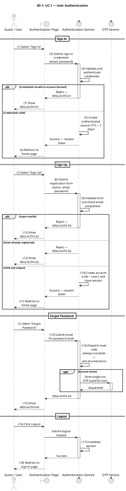
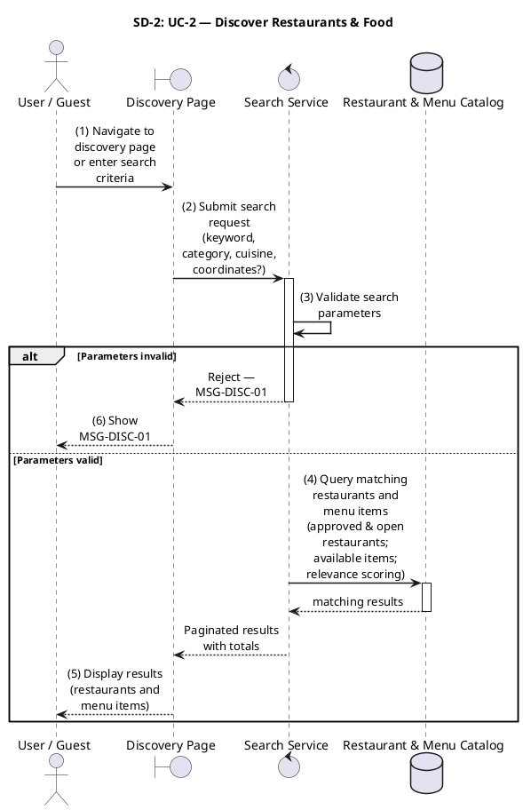
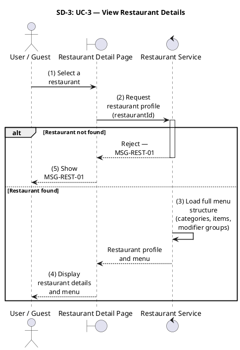
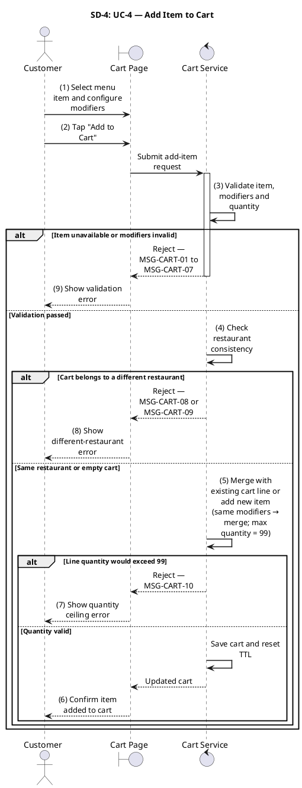
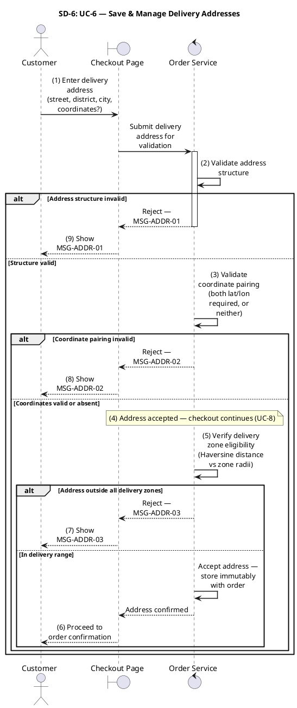
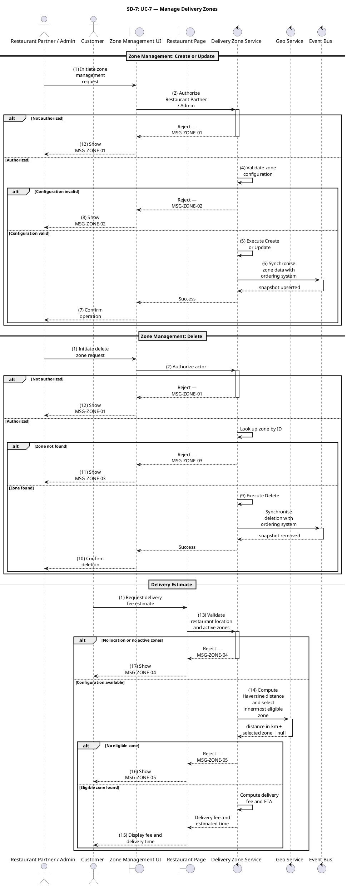
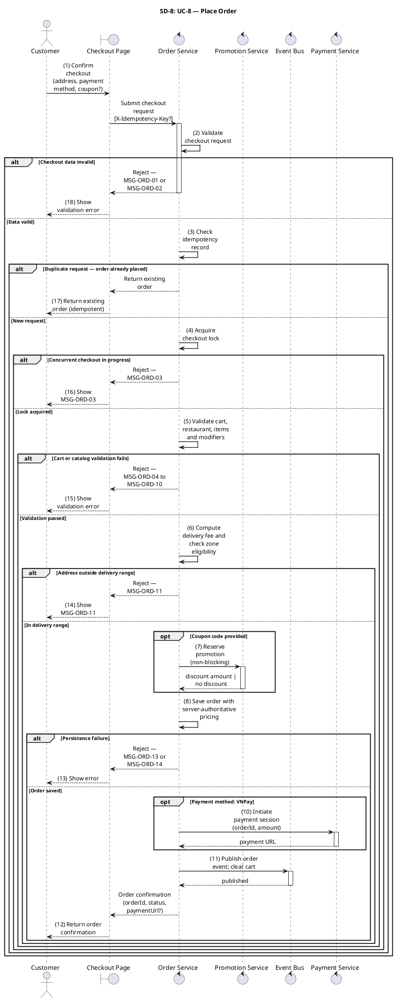
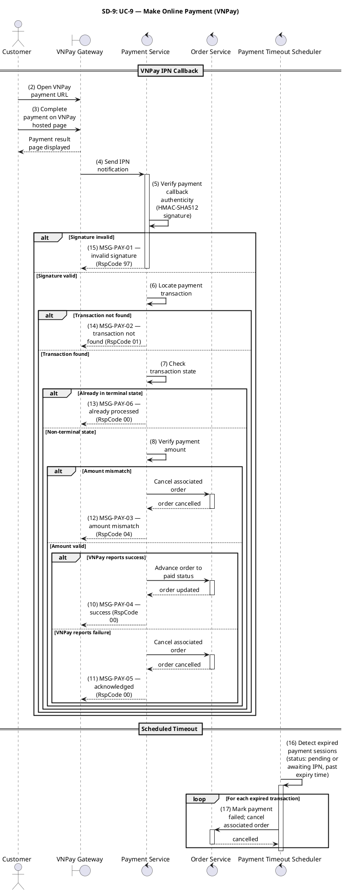
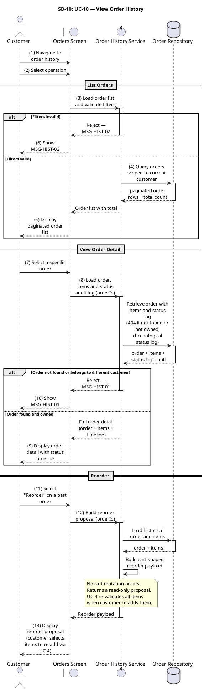

# SRS Sequence Diagrams — Appendix SD
## SoLi Food Delivery Application

**Document Version:** 2.0
**Status:** Final
**Scope:** UC-1 through UC-10 — Enterprise-Style PlantUML Sequence Diagrams
**Traceability:** Root message numbers correspond **directly** to Activity Diagram step numbers in `SRS_FoodDelivery.md`.

---

## Table of Contents

- [SD-1: UC-1 — User Authentication](#sd-1-uc-1--user-authentication)
- [SD-2: UC-2 — Discover Restaurants & Food](#sd-2-uc-2--discover-restaurants--food)
- [SD-3: UC-3 — View Restaurant Details](#sd-3-uc-3--view-restaurant-details)
- [SD-4: UC-4 — Add Item to Cart](#sd-4-uc-4--add-item-to-cart)
- [SD-5: UC-5 — Manage Shopping Cart](#sd-5-uc-5--manage-shopping-cart)
- [SD-6: UC-6 — Save & Manage Delivery Addresses](#sd-6-uc-6--save--manage-delivery-addresses)
- [SD-7: UC-7 — Manage Delivery Zones](#sd-7-uc-7--manage-delivery-zones)
- [SD-8: UC-8 — Place Order](#sd-8-uc-8--place-order)
- [SD-9: UC-9 — Make Online Payment (VNPay)](#sd-9-uc-9--make-online-payment-vnpay)
- [SD-10: UC-10 — View Order History](#sd-10-uc-10--view-order-history)

---

## SD-1: UC-1 — User Authentication

---

## SD-2: UC-2 — Discover Restaurants & Food

---

## SD-3: UC-3 — View Restaurant Details

---

## SD-4: UC-4 — Add Item to Cart

---

## SD-5: UC-5 — Manage Shopping Cart

```plantuml
@startuml SD-5_ManageCart

skinparam shadowing false
skinparam sequenceMessageAlign center
skinparam responseMessageBelowArrow true
skinparam maxMessageSize 120
skinparam sequenceArrowThickness 1.5
skinparam ParticipantPadding 20
skinparam BoxPadding 10

title SD-5: UC-5 — Manage Shopping Cart

actor "Customer" as Actor
boundary "Cart Page" as UI
control "Cart Service" as CartSvc
database "Cart Store" as CartStore

autonumber stop

Actor -> UI : (1) Open cart

== View Cart ==

UI -> CartSvc : (3) Load and return cart contents
activate CartSvc
CartSvc -> CartStore : Retrieve customer cart
activate CartStore
CartStore --> CartSvc : cart | null
deactivate CartStore
CartSvc --> UI : Cart contents (or null)
deactivate CartSvc
UI --> Actor : Display cart

== Update Item Quantity ==

Actor -> UI : (2) Select "Update Quantity"
UI -> CartSvc : (4) Submit quantity update
activate CartSvc

CartSvc -> CartSvc : Validate quantity and find line

alt Line not found
    CartSvc --> UI : Reject — MSG-CART-11
    deactivate CartSvc
    UI --> Actor : (6) Show MSG-CART-11
else Line found
    CartSvc -> CartStore : (5) Save updated cart (reset TTL)
    activate CartStore
    CartStore --> CartSvc : saved
    deactivate CartStore
    CartSvc --> UI : Updated cart
    deactivate CartSvc
    UI --> Actor : Display updated cart
end

== Update Item Modifiers ==

Actor -> UI : (2) Select "Update Modifiers"
UI -> CartSvc : (7) Submit modifier update
activate CartSvc

CartSvc -> CartSvc : Validate modifier set and re-fingerprint line

alt Modifiers invalid
    CartSvc --> UI : Reject — MSG-CART-03 to MSG-CART-07
    deactivate CartSvc
    UI --> Actor : (9) Show modifier validation error
else Merged quantity would exceed 99
    CartSvc --> UI : Reject — MSG-CART-10
    deactivate CartSvc
    UI --> Actor : (9) Show quantity overflow error
else Valid
    CartSvc -> CartStore : Save updated cart
    activate CartStore
    CartStore --> CartSvc : saved
    deactivate CartStore
    CartSvc --> UI : Updated cart
    deactivate CartSvc
    UI --> Actor : (8) Display updated cart with new modifiers
end

== Remove Item ==

Actor -> UI : (2) Select "Remove Item"
UI -> CartSvc : (10) Remove line item (cartItemId)
activate CartSvc

alt Line not found
    CartSvc --> UI : Reject — MSG-CART-11
    deactivate CartSvc
    UI --> Actor : (11) Show MSG-CART-11
else Line found
    CartSvc -> CartStore : Remove line and save cart
    activate CartStore
    CartStore --> CartSvc : saved | deleted
    deactivate CartStore
    CartSvc --> UI : Cart (or null)
    deactivate CartSvc
    UI --> Actor : Display updated cart
end

== Clear Cart ==

Actor -> UI : (2) Select "Clear Cart"
UI -> CartSvc : (12) Delete entire cart (idempotent)
activate CartSvc
CartSvc -> CartStore : Delete customer cart
activate CartStore
CartStore --> CartSvc : deleted
deactivate CartStore
CartSvc --> UI : Confirmed
deactivate CartSvc
UI --> Actor : (13) Confirm cart cleared

@enduml
```

---

## SD-6: UC-6 — Save & Manage Delivery Addresses

---

## SD-7: UC-7 — Manage Delivery Zones

---

## SD-8: UC-8 — Place Order

---

## SD-9: UC-9 — Make Online Payment (VNPay)

---

## SD-10: UC-10 — View Order History

---

*End of Appendix SD — Sequence Diagrams v2.0*
