# SRS Sequence Diagrams — Appendix SD
## SoLi Food Delivery Application

**Document Version:** 2.0
**Status:** Final
**Scope:** UC-1 through UC-26 — Enterprise-Style PlantUML Sequence Diagrams
**Traceability:** Root message numbers correspond **directly** to Activity Diagram step numbers in `SRS_FoodDelivery.md`.

---

## Table of Contents

- [SD-1: UC-1 — User Authentication](#sd-1-uc-1--user-authentication)
- [SD-2: UC-2 — Discover Restaurants & Food](#sd-2-uc-2--discover-restaurants--food)
- [SD-3: UC-3 — View Restaurant Details](#sd-3-uc-3--view-restaurant-details)
- [SD-4: UC-4 — Add Item to Cart](#sd-4-uc-4--add-item-to-cart)
- [SD-5: UC-5 — Manage Shopping Cart](#sd-5-uc-5--manage-shopping-cart)
- [SD-6: UC-6 — Save & Manage Delivery Addresses](#sd-6-uc-6--save--manage-delivery-addresses)
- [SD-7: UC-7 — Manage Delivery Zones](#sd-7-uc-7--manage-delivery-zones)
- [SD-8: UC-8 — Place Order](#sd-8-uc-8--place-order)
- [SD-9: UC-9 — Make Online Payment (VNPay)](#sd-9-uc-9--make-online-payment-vnpay)
- [SD-10: UC-10 — View Order History](#sd-10-uc-10--view-order-history)
- [SD-11: UC-11 — Restaurant Registration & Profile Management](#sd-11-uc-11--restaurant-registration--profile-management)
- [SD-12: UC-12 — Manage Menu Catalog](#sd-12-uc-12--manage-menu-catalog)
- [SD-13: UC-13 — Toggle Item & Restaurant Availability](#sd-13-uc-13--toggle-item--restaurant-availability)
- [SD-14: UC-14 — Accept or Reject Order](#sd-14-uc-14--accept-or-reject-order)
- [SD-15: UC-15 — Prepare Order for Pickup](#sd-15-uc-15--prepare-order-for-pickup)
- [SD-16: UC-16 — Shipper Registration](#sd-16-uc-16--shipper-registration)
- [SD-17: UC-17 — Manage Shipper Availability](#sd-17-uc-17--manage-shipper-availability)
- [SD-18: UC-18 — Accept Delivery Assignment](#sd-18-uc-18--accept-delivery-assignment)
- [SD-19: UC-19 — Deliver Order](#sd-19-uc-19--deliver-order)
- [SD-20: UC-20 — Track Order Status](#sd-20-uc-20--track-order-status)
- [SD-21: UC-21 — Cancel Order](#sd-21-uc-21--cancel-order)
- [SD-22: UC-22 — Submit Rating & Review](#sd-22-uc-22--submit-rating--review)
- [SD-23: UC-23 — Manage Restaurant Promotions](#sd-23-uc-23--manage-restaurant-promotions)
- [SD-24: UC-24 — Manage Platform Promotions](#sd-24-uc-24--manage-platform-promotions)
- [SD-25: UC-25 — Process Payment Refund](#sd-25-uc-25--process-payment-refund)
- [SD-26: UC-26 — Manage Real-Time Notifications](#sd-26-uc-26--manage-real-time-notifications)

---

## SD-1: UC-1 — User Authentication

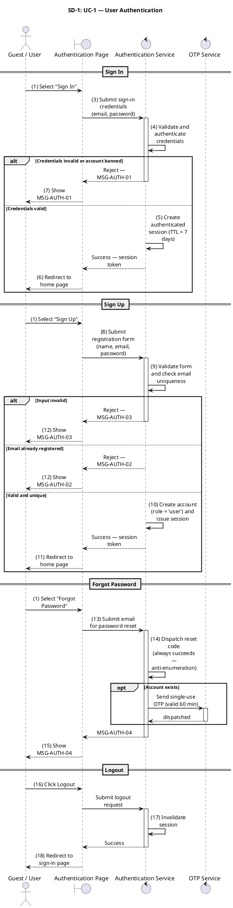

---

## SD-2: UC-2 — Discover Restaurants & Food

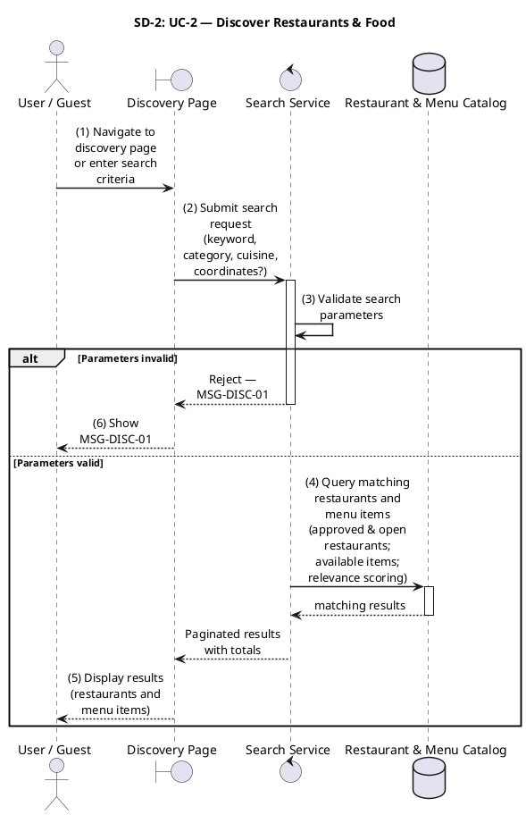

---

## SD-3: UC-3 — View Restaurant Details

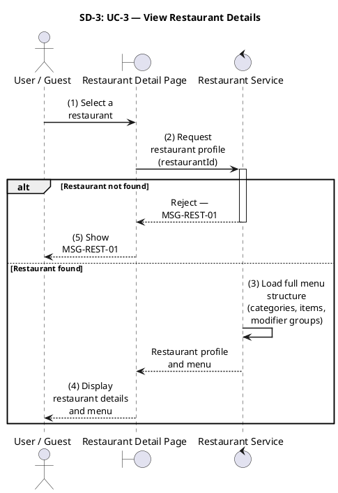

---

## SD-4: UC-4 — Add Item to Cart

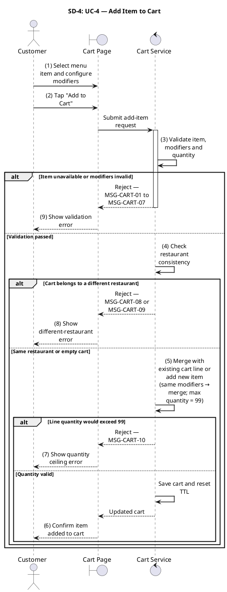

---

## SD-5: UC-5 — Manage Shopping Cart

```plantuml
@startuml SD-5_ManageCart

skinparam shadowing false
skinparam sequenceMessageAlign center
skinparam responseMessageBelowArrow true
skinparam maxMessageSize 120
skinparam sequenceArrowThickness 1.5
skinparam ParticipantPadding 20
skinparam BoxPadding 10

title SD-5: UC-5 — Manage Shopping Cart

actor "Customer" as Actor
boundary "Cart Page" as UI
control "Cart Service" as CartSvc
database "Cart Store" as CartStore

autonumber stop

Actor -> UI : (1) Open cart

== View Cart ==

UI -> CartSvc : (3) Load and return cart contents
activate CartSvc
CartSvc -> CartStore : Retrieve customer cart
activate CartStore
CartStore --> CartSvc : cart | null
deactivate CartStore
CartSvc --> UI : Cart contents (or null)
deactivate CartSvc
UI --> Actor : Display cart

== Update Item Quantity ==

Actor -> UI : (2) Select "Update Quantity"
UI -> CartSvc : (4) Submit quantity update
activate CartSvc

CartSvc -> CartSvc : Validate quantity and find line

alt Line not found
    CartSvc --> UI : Reject — MSG-CART-11
    deactivate CartSvc
    UI --> Actor : (6) Show MSG-CART-11
else Line found
    CartSvc -> CartStore : (5) Save updated cart (reset TTL)
    activate CartStore
    CartStore --> CartSvc : saved
    deactivate CartStore
    CartSvc --> UI : Updated cart
    deactivate CartSvc
    UI --> Actor : Display updated cart
end

== Update Item Modifiers ==

Actor -> UI : (2) Select "Update Modifiers"
UI -> CartSvc : (7) Submit modifier update
activate CartSvc

CartSvc -> CartSvc : Validate modifier set and re-fingerprint line

alt Modifiers invalid
    CartSvc --> UI : Reject — MSG-CART-03 to MSG-CART-07
    deactivate CartSvc
    UI --> Actor : (9) Show modifier validation error
else Merged quantity would exceed 99
    CartSvc --> UI : Reject — MSG-CART-10
    deactivate CartSvc
    UI --> Actor : (9) Show quantity overflow error
else Valid
    CartSvc -> CartStore : Save updated cart
    activate CartStore
    CartStore --> CartSvc : saved
    deactivate CartStore
    CartSvc --> UI : Updated cart
    deactivate CartSvc
    UI --> Actor : (8) Display updated cart with new modifiers
end

== Remove Item ==

Actor -> UI : (2) Select "Remove Item"
UI -> CartSvc : (10) Remove line item (cartItemId)
activate CartSvc

alt Line not found
    CartSvc --> UI : Reject — MSG-CART-11
    deactivate CartSvc
    UI --> Actor : (11) Show MSG-CART-11
else Line found
    CartSvc -> CartStore : Remove line and save cart
    activate CartStore
    CartStore --> CartSvc : saved | deleted
    deactivate CartStore
    CartSvc --> UI : Cart (or null)
    deactivate CartSvc
    UI --> Actor : Display updated cart
end

== Clear Cart ==

Actor -> UI : (2) Select "Clear Cart"
UI -> CartSvc : (12) Delete entire cart (idempotent)
activate CartSvc
CartSvc -> CartStore : Delete customer cart
activate CartStore
CartStore --> CartSvc : deleted
deactivate CartStore
CartSvc --> UI : Confirmed
deactivate CartSvc
UI --> Actor : (13) Confirm cart cleared

@enduml
```

---

## SD-6: UC-6 — Save & Manage Delivery Addresses

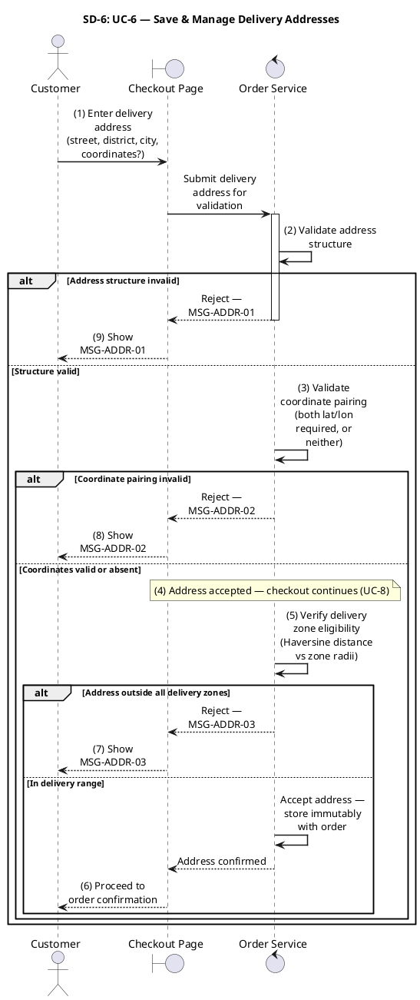

---

## SD-7: UC-7 — Manage Delivery Zones

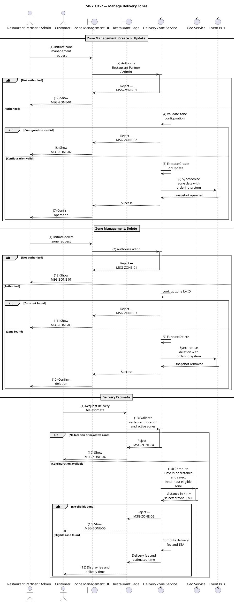

---

## SD-8: UC-8 — Place Order

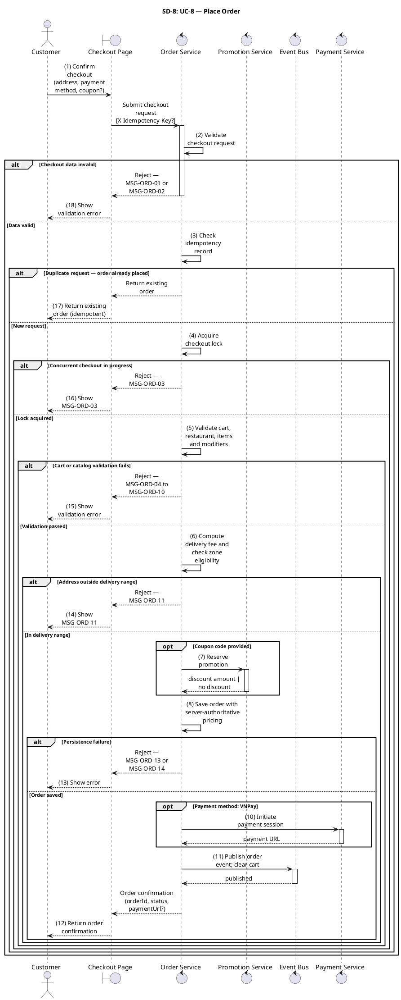

---

## SD-9: UC-9 — Make Online Payment (VNPay)

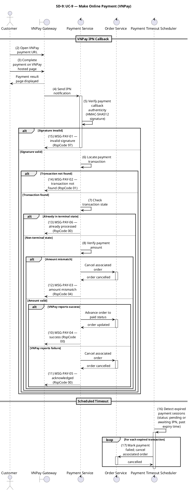

---

## SD-10: UC-10 — View Order History

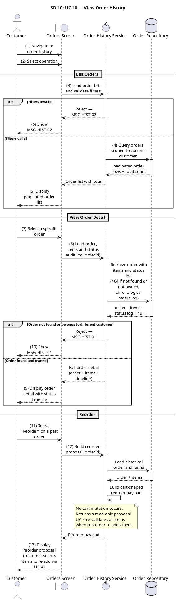

---

## SD-11: UC-11 — Restaurant Registration & Profile Management

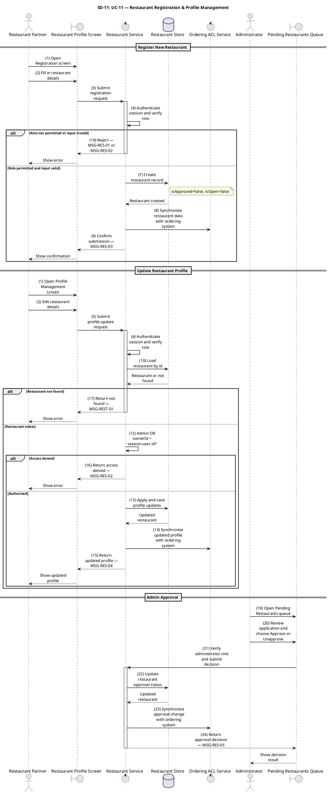

---

## SD-12: UC-12 — Manage Menu Catalog

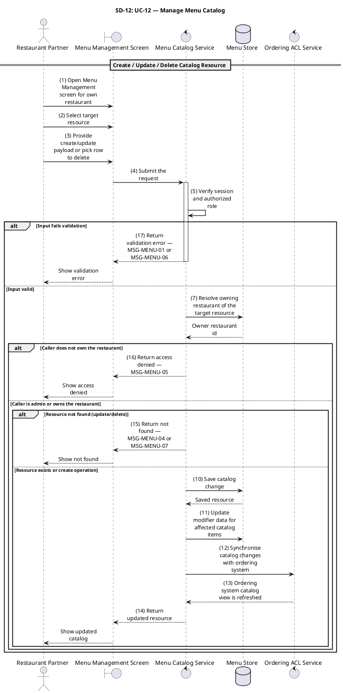

---

## SD-13: UC-13 — Toggle Item & Restaurant Availability

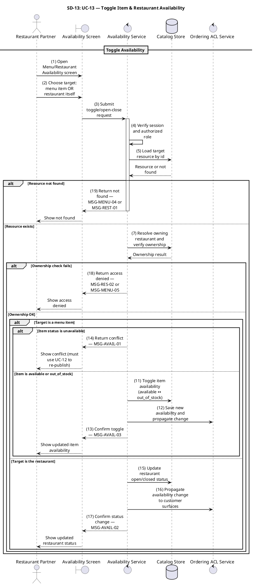

---

## SD-14: UC-14 — Accept or Reject Order

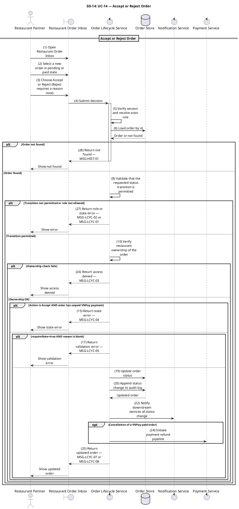

---

## SD-15: UC-15 — Prepare Order for Pickup

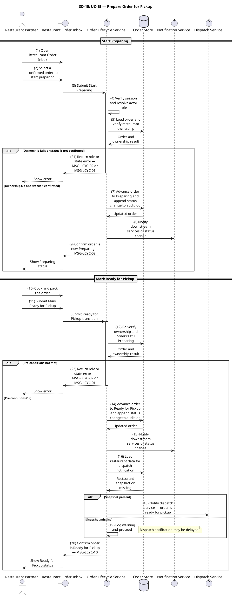

---

## SD-16: UC-16 — Shipper Registration

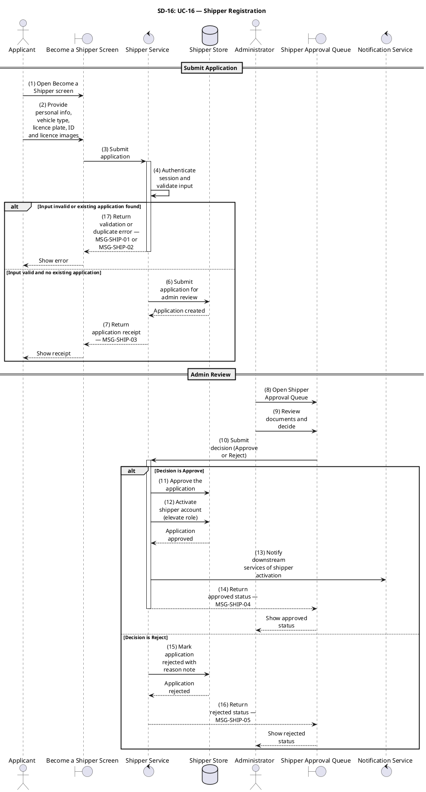

---

## SD-17: UC-17 — Manage Shipper Availability

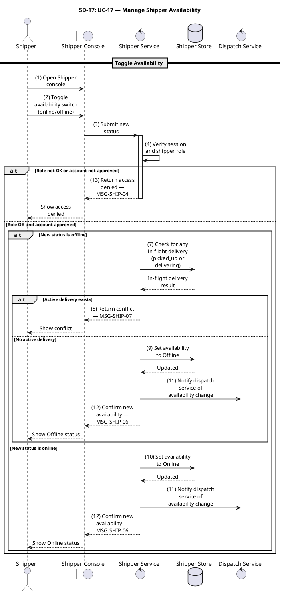

---

## SD-18: UC-18 — Accept Delivery Assignment

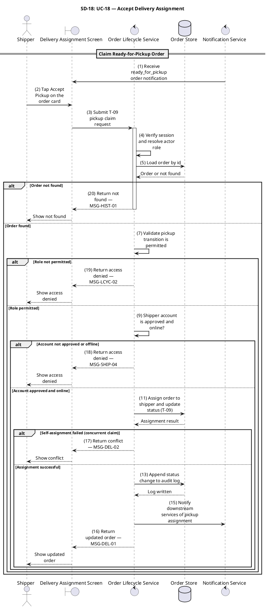

---

## SD-19: UC-19 — Deliver Order

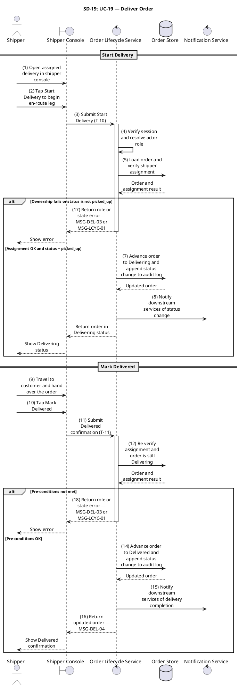

---

## SD-20: UC-20 — Track Order Status

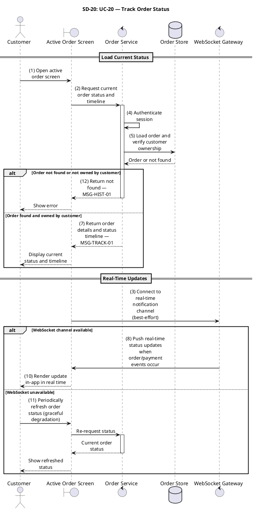

---

## SD-21: UC-21 — Cancel Order

```plantuml
@startuml SD-21_CancelOrder

skinparam shadowing false
skinparam sequenceMessageAlign center
skinparam responseMessageBelowArrow true
skinparam maxMessageSize 120
skinparam sequenceArrowThickness 1.5
skinparam ParticipantPadding 20
skinparam BoxPadding 10

title SD-21: UC-21 — Cancel Order

actor "Customer" as Actor
boundary "Active Order Screen" as UI
control "Order Lifecycle Service" as LifecycleSvc
database "Order Store" as OrderDB
control "Notification Service" as NotifSvc
control "Payment Service" as PaySvc
control "Promotion Service" as PromoSvc

autonumber stop

== Cancel Order ==

Actor -> UI : (1) Open active order screen
Actor -> UI : (2) Tap Cancel Order and enter a non-empty reason
UI -> LifecycleSvc : (3) Submit cancellation with reason
activate LifecycleSvc

LifecycleSvc -> LifecycleSvc : (4) Verify session and actor role
LifecycleSvc -> OrderDB : (5) Load order and verify customer ownership
OrderDB --> LifecycleSvc : Order or not found

alt Order not found or not owned by customer
    LifecycleSvc --> UI : (21) Return not found — MSG-HIST-01
    deactivate LifecycleSvc
    UI --> Actor : Show not found
else Order found
    alt Reason is empty
        LifecycleSvc --> UI : (20) Return validation error — MSG-CANC-01
        deactivate LifecycleSvc
        UI --> Actor : Show validation error
    else Reason provided
        alt Current status not in pending or paid
            LifecycleSvc --> UI : (19) Return state error — MSG-CANC-02
            deactivate LifecycleSvc
            UI --> Actor : Show state error
        else Status is pending or paid
            LifecycleSvc -> OrderDB : (10) Cancel order and append status change to audit log
            OrderDB --> LifecycleSvc : Cancellation result

            alt Optimistic lock failed
                LifecycleSvc --> UI : (18) Return conflict — MSG-LCYC-06
                deactivate LifecycleSvc
                UI --> Actor : Show conflict
            else Lock succeeded
                LifecycleSvc -> NotifSvc : (12) Notify downstream services of cancellation
                alt Order was paid via VNPay
                    LifecycleSvc -> PaySvc : (14) Initiate payment refund pipeline
                else COD or unpaid order
                    LifecycleSvc -> LifecycleSvc : (15) No refund applicable
                end
                LifecycleSvc -> PromoSvc : (16) Roll back any applied promotion reservations
                LifecycleSvc --> UI : (17) Return updated order — MSG-CANC-03
                deactivate LifecycleSvc
                UI --> Actor : Show cancellation confirmation
            end
        end
    end
end

@enduml
```

---

## SD-22: UC-22 — Submit Rating & Review

```plantuml
@startuml SD-22_SubmitRatingReview

skinparam shadowing false
skinparam sequenceMessageAlign center
skinparam responseMessageBelowArrow true
skinparam maxMessageSize 120
skinparam sequenceArrowThickness 1.5
skinparam ParticipantPadding 20
skinparam BoxPadding 10

title SD-22: UC-22 — Submit Rating & Review

actor "Customer" as Actor
boundary "Delivered Order Screen" as UI
control "Review Service" as ReviewSvc
database "Review Store" as ReviewDB
database "Restaurant Store" as RestDB

autonumber stop

== Submit Rating ==

Actor -> UI : (1) Open delivered order screen
Actor -> UI : (2) Select Rate & Review — choose 1–5 stars + optional comment
UI -> ReviewSvc : (3) Submit rating and optional comment
activate ReviewSvc

ReviewSvc -> ReviewSvc : (4) Authenticate session
ReviewSvc -> ReviewSvc : (5) Validate rating and comment content

alt Payload invalid
    ReviewSvc --> UI : (18) Return validation error — MSG-RATE-01
    deactivate ReviewSvc
    UI --> Actor : Show validation error
else Payload valid
    ReviewSvc -> ReviewDB : (7) Load order and verify customer ownership
    ReviewDB --> ReviewSvc : Order or not found

    alt Order not found or not owned
        ReviewSvc --> UI : (17) Return not found — MSG-HIST-01
        deactivate ReviewSvc
        UI --> Actor : Show not found
    else Order found
        alt Order status is not delivered
            ReviewSvc --> UI : (16) Return state error — MSG-RATE-02
            deactivate ReviewSvc
            UI --> Actor : Show state error
        else Order is delivered
            ReviewSvc -> ReviewDB : (10) Check if review already exists
            ReviewDB --> ReviewSvc : Existing review or none

            alt Review already exists
                ReviewSvc --> UI : (15) Return conflict — MSG-RATE-03
                deactivate ReviewSvc
                UI --> Actor : Show conflict
            else No existing review
                ReviewSvc -> ReviewDB : (12) Save and publish review
                ReviewDB --> ReviewSvc : Review saved
                ReviewSvc -> RestDB : (13) Update restaurant aggregate rating
                ReviewSvc --> UI : (14) Return confirmation — MSG-RATE-04
                deactivate ReviewSvc
                UI --> Actor : Show confirmation
            end
        end
    end
end

@enduml
```

---

## SD-23: UC-23 — Manage Restaurant Promotions

```plantuml
@startuml SD-23_ManageRestaurantPromotions

skinparam shadowing false
skinparam sequenceMessageAlign center
skinparam responseMessageBelowArrow true
skinparam maxMessageSize 120
skinparam sequenceArrowThickness 1.5
skinparam ParticipantPadding 20
skinparam BoxPadding 10

title SD-23: UC-23 — Manage Restaurant Promotions

actor "Restaurant Partner" as Partner
boundary "Promotion Dashboard" as UI
control "Promotion Service" as PromoSvc
database "Promotion Store" as PromoDB
database "Restaurant Store" as RestDB

autonumber stop

== Read / Create / Update / Lifecycle ==

Partner -> UI : (1) Open promotion dashboard
Partner -> UI : (2) Submit create/update/list/lifecycle request
UI -> PromoSvc : Submit request
activate PromoSvc

PromoSvc -> PromoSvc : (3) Verify session and restaurant role
PromoSvc -> RestDB : (4) Load restaurant record
RestDB --> PromoSvc : Restaurant or not found

alt Restaurant not found, not owned, or not approved
    PromoSvc --> UI : (19) Return access denied — MSG-PROMO-02
    deactivate PromoSvc
    UI --> Partner : Show access denied
else Restaurant valid and owned
    alt Operation is read (GET)
        PromoSvc -> PromoDB : Load promotion list or detail
        PromoDB --> PromoSvc : Promotion data
        PromoSvc --> UI : (7) Return restaurant's promotion list or detail
        deactivate PromoSvc
        UI --> Partner : Display promotions
    else Write operation
        PromoSvc -> PromoSvc : (8) Validate payload

        alt Payload invalid
            PromoSvc --> UI : (18) Return validation error — MSG-PROMO-01
            deactivate PromoSvc
            UI --> Partner : Show validation error
        else Payload valid
            alt Operation is create
                PromoSvc -> PromoDB : (10) Create promotion in Draft status
                PromoDB --> PromoSvc : Promotion created
                PromoSvc --> UI : (17) Return the resulting promotion
                deactivate PromoSvc
                UI --> Partner : Show new promotion
            else Update or lifecycle change
                PromoSvc -> PromoDB : (11) Load existing promotion and verify restaurant ownership
                PromoDB --> PromoSvc : Promotion or not found

                alt Promotion not found or not owned by restaurant
                    PromoSvc --> UI : (16) Return not found — MSG-PROMO-03
                    deactivate PromoSvc
                    UI --> Partner : Show not found
                else Promotion found
                    alt Status transition not permitted
                        PromoSvc --> UI : (15) Return state error — MSG-PROMO-05
                        deactivate PromoSvc
                        UI --> Partner : Show state error
                    else Transition permitted
                        PromoSvc -> PromoDB : (14) Apply and save changes
                        PromoDB --> PromoSvc : Updated promotion
                        PromoSvc --> UI : (17) Return the resulting promotion
                        deactivate PromoSvc
                        UI --> Partner : Show updated promotion
                    end
                end
            end
        end
    end
end

@enduml
```

---

## SD-24: UC-24 — Manage Platform Promotions

```plantuml
@startuml SD-24_ManagePlatformPromotions

skinparam shadowing false
skinparam sequenceMessageAlign center
skinparam responseMessageBelowArrow true
skinparam maxMessageSize 120
skinparam sequenceArrowThickness 1.5
skinparam ParticipantPadding 20
skinparam BoxPadding 10

title SD-24: UC-24 — Manage Platform Promotions

actor "Administrator" as Admin
boundary "Admin Promotion Console" as UI
control "Promotion Service" as PromoSvc
database "Promotion Store" as PromoDB

autonumber stop

== Admin Promotion & Coupon Management ==

Admin -> UI : (1) Open admin promotion console
Admin -> UI : (2) Submit promotion or coupon request
UI -> PromoSvc : Submit request
activate PromoSvc

PromoSvc -> PromoSvc : (3) Verify admin session

alt Operation is read (GET)
    PromoSvc -> PromoDB : Load promotion and coupon data
    PromoDB --> PromoSvc : Data
    PromoSvc --> UI : (5) Return promotion and coupon list or detail
    deactivate PromoSvc
    UI --> Admin : Display data
else Write operation
    alt Operation is coupon issuance
        PromoSvc -> PromoDB : (7) Load parent promotion
        PromoDB --> PromoSvc : Promotion or not found

        alt Promotion not found or does not support coupon codes
            PromoSvc --> UI : (13) Return not found or state error — MSG-PROMO-03 or MSG-PROMO-05
            deactivate PromoSvc
            UI --> Admin : Show error
        else Promotion supports coupons
            PromoSvc -> PromoSvc : (9) Validate coupon batch payload

            alt Payload invalid
                PromoSvc --> UI : (12) Return validation error — MSG-PROMO-01
                deactivate PromoSvc
                UI --> Admin : Show validation error
            else Payload valid
                PromoSvc -> PromoDB : (10) Issue and save provided coupon codes
                PromoDB --> PromoSvc : Issued codes
                PromoSvc --> UI : (11) Return issued codes — MSG-PROMO-10
                deactivate PromoSvc
                UI --> Admin : Show issued codes
            end
        end
    else Create or lifecycle change
        PromoSvc -> PromoSvc : (14) Validate payload

        alt Payload invalid
            PromoSvc --> UI : (21) Return validation error — MSG-PROMO-01
            deactivate PromoSvc
            UI --> Admin : Show validation error
        else Payload valid
            PromoSvc -> PromoDB : (15) Load target promotion (if not create)
            PromoDB --> PromoSvc : Promotion or not found

            alt Promotion not found
                PromoSvc --> UI : (20) Return not found — MSG-PROMO-03
                deactivate PromoSvc
                UI --> Admin : Show not found
            else Promotion found or create
                alt Status transition not permitted
                    PromoSvc --> UI : (19) Return state error — MSG-PROMO-05
                    deactivate PromoSvc
                    UI --> Admin : Show state error
                else Transition permitted
                    PromoSvc -> PromoDB : (17) Apply and save promotion change
                    PromoDB --> PromoSvc : Updated promotion
                    PromoSvc --> UI : (18) Return the resulting promotion
                    deactivate PromoSvc
                    UI --> Admin : Show updated promotion
                end
            end
        end
    end
end

@enduml
```

---

## SD-25: UC-25 — Process Payment Refund

```plantuml
@startuml SD-25_ProcessPaymentRefund

skinparam shadowing false
skinparam sequenceMessageAlign center
skinparam responseMessageBelowArrow true
skinparam maxMessageSize 120
skinparam sequenceArrowThickness 1.5
skinparam ParticipantPadding 20
skinparam BoxPadding 10

title SD-25: UC-25 — Process Payment Refund

control "Ordering BC" as OrderingBC
control "Payment Service" as PaySvc
database "Payment Store" as PayDB
control "Payment Gateway" as Gateway
control "Notification Service" as NotifSvc

autonumber stop

== Automated Refund (Event-Driven) ==

OrderingBC -> PaySvc : (2) Signal Payment BC to initiate refund
note right of OrderingBC : T-05 or T-07 cancellation on VNPay-paid order
activate PaySvc

PaySvc -> PayDB : (4) Look up confirmed payment transaction
PayDB --> PaySvc : Transaction or not found

alt Completed transaction not found
    PaySvc -> PaySvc : (18) Log and exit (COD or already-refunded order)
    deactivate PaySvc
else Completed transaction found
    alt amount <= 0
        PaySvc -> PaySvc : (17) Log data anomaly and exit
        deactivate PaySvc
    else amount > 0
        alt Status already refund_pending or refunded
            PaySvc -> PaySvc : (8) Log duplicate event and exit — MSG-REFUND-02
            deactivate PaySvc
        else Status is completed
            PaySvc -> PayDB : (9) Mark transaction as refund in progress
            PayDB --> PaySvc : Lock result

            alt Optimistic lock lost
                PaySvc -> PaySvc : (16) Concurrent handler is processing refund — exit
                deactivate PaySvc
            else Lock won
                PaySvc -> NotifSvc : (11) Notify customer that refund has been initiated — MSG-REFUND-01
                PaySvc -> Gateway : (12) Submit refund request to payment gateway
                Gateway --> PaySvc : Gateway response

                alt Gateway responded success
                    PaySvc -> PayDB : (14) Record successful refund completion
                    PayDB --> PaySvc : Updated
                    deactivate PaySvc
                else Gateway failure
                    PaySvc -> PayDB : (15) Record refund attempt failure; schedule retry — MSG-REFUND-04
                    PayDB --> PaySvc : Updated
                    deactivate PaySvc
                end
            end
        end
    end
end

@enduml
```

---

## SD-26: UC-26 — Manage Real-Time Notifications

```plantuml
@startuml SD-26_ManageRealTimeNotifications

skinparam shadowing false
skinparam sequenceMessageAlign center
skinparam responseMessageBelowArrow true
skinparam maxMessageSize 120
skinparam sequenceArrowThickness 1.5
skinparam ParticipantPadding 20
skinparam BoxPadding 10

title SD-26: UC-26 — Manage Real-Time Notifications

control "Publishing BC" as PublisherBC
control "Notification Service" as NotifSvc
database "Notification Store" as NotifDB
control "Channel Dispatcher" as Dispatcher
control "Push Provider (FCM)" as FCM
actor "Authenticated User" as User
boundary "Notification Inbox" as UI

autonumber stop

== Event-Driven Dispatch ==

PublisherBC -> NotifSvc : (1) Publish domain event
note right of PublisherBC : OrderStatusChangedEvent, OrderPlacedEvent,\nPaymentConfirmedEvent, PaymentFailedEvent,\nOrderCancelledAfterPaymentEvent
activate NotifSvc

NotifSvc -> NotifSvc : (2) Identify notification type and recipients
NotifSvc -> NotifDB : (3) Load each recipient's notification preferences
NotifDB --> NotifSvc : Preferences (or defaults)

alt Recipient has muted this type
    NotifSvc -> NotifDB : (5) Persist notification record for audit — skip delivery
    deactivate NotifSvc
else Recipient has not muted
    NotifSvc -> NotifSvc : (6) Determine enabled delivery channels per recipient preferences

    alt Type is critical (system_announcement, new_order_received)
        NotifSvc -> NotifSvc : (8) Bypass quiet-hours suppression
    else Non-critical type
        alt Quiet hours active and within quiet window
            NotifSvc -> NotifSvc : (10) Remove push from enabled channels
note right : in-app is always persisted
        else Outside quiet window
            NotifSvc -> NotifSvc : (11) Keep all enabled channels
        end
    end

    NotifSvc -> NotifDB : (12) Persist notification record per channel (deduplicated)
    NotifDB --> NotifSvc : Records saved
    NotifSvc -> Dispatcher : (13) Dispatch notification to enabled channels concurrently
    activate Dispatcher
    Dispatcher -> FCM : Push via FCM
    FCM --> Dispatcher : Delivery result
    Dispatcher --> NotifSvc : (14) Record delivery outcome per channel
    deactivate Dispatcher

    alt Push delivery returned invalid or unregistered token
        NotifSvc -> NotifDB : (16) Mark invalid device token as inactive
    else Token valid
        NotifSvc -> NotifSvc : (17) Leave device tokens unchanged
    end
    deactivate NotifSvc
end

== REST Inbox & Preference Management ==

User -> UI : (18) Manage inbox, preferences and push tokens via REST endpoints
UI -> NotifSvc : Submit management request
activate NotifSvc

NotifSvc -> NotifDB : (19) Apply change and synchronise read-state across all active sessions
NotifDB --> NotifSvc : Updated
NotifSvc --> UI : Return updated state
deactivate NotifSvc
UI --> User : Show updated inbox / preferences

@enduml
```

---

*End of Appendix SD — Sequence Diagrams v2.0*
