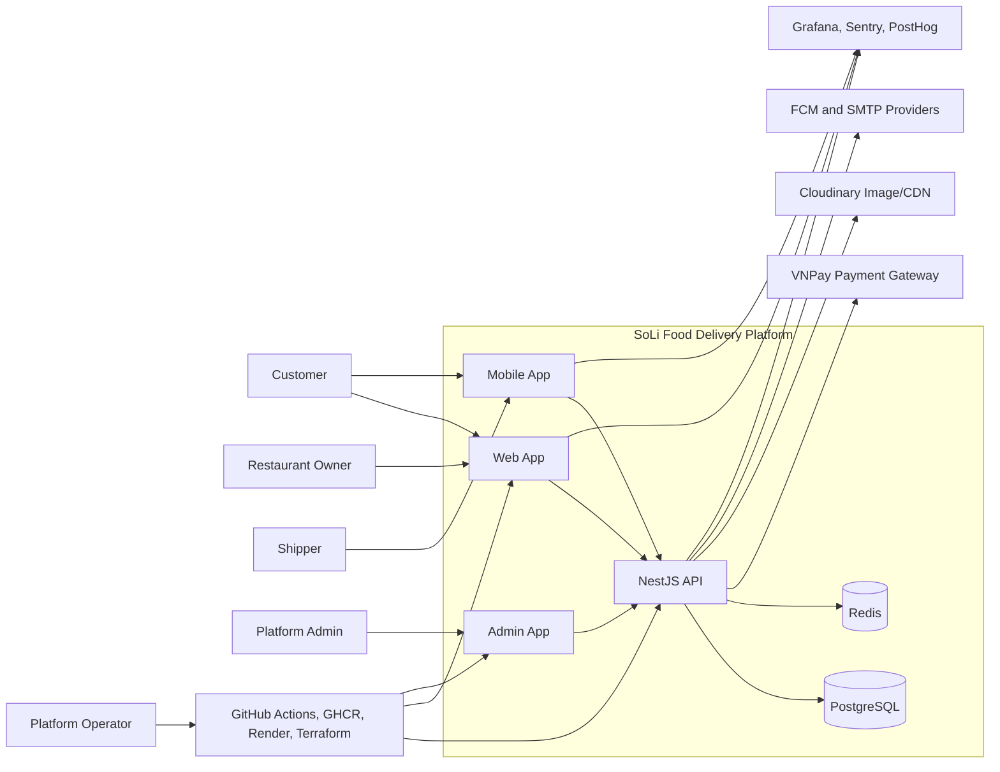
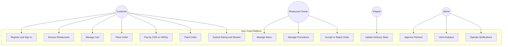
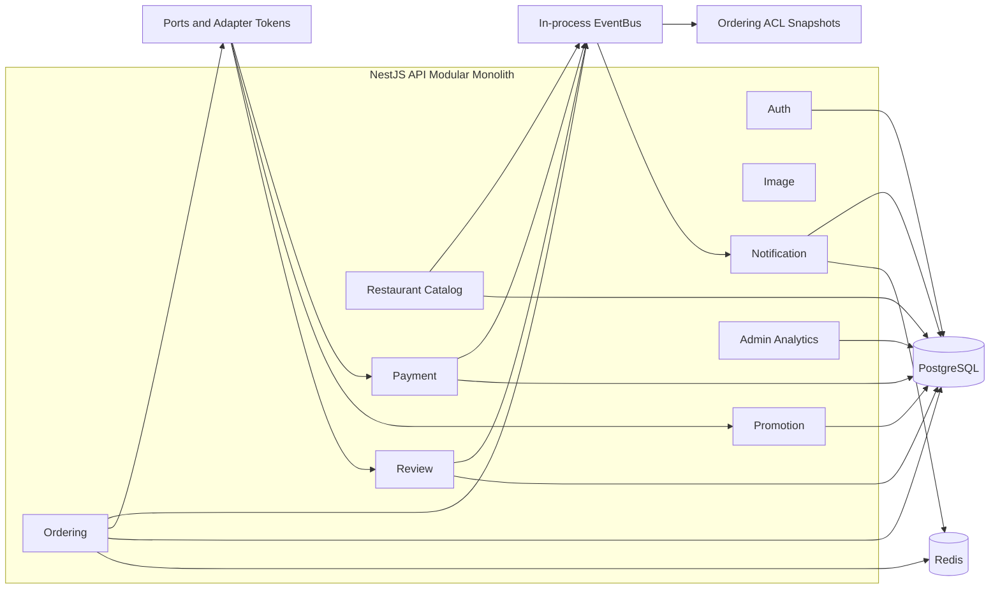
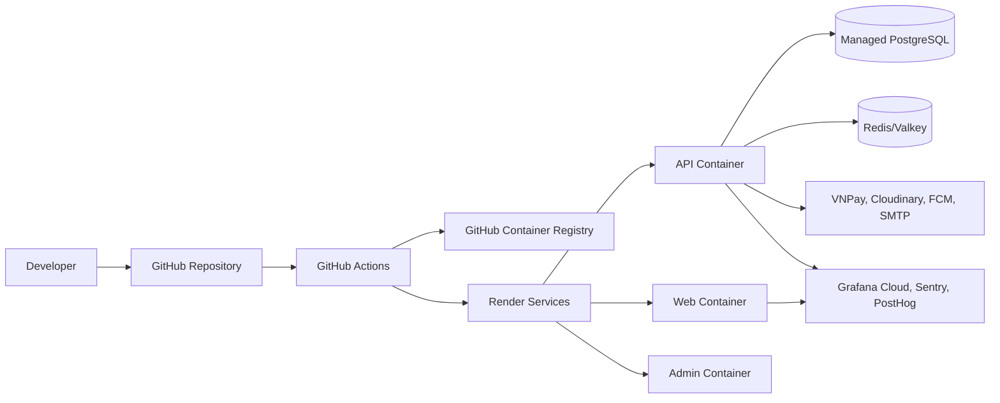
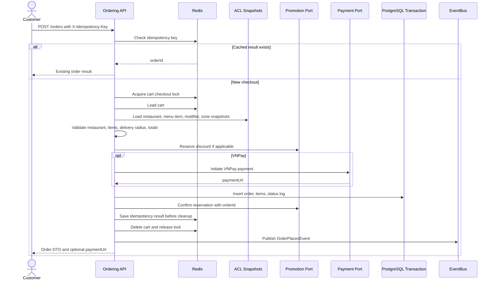
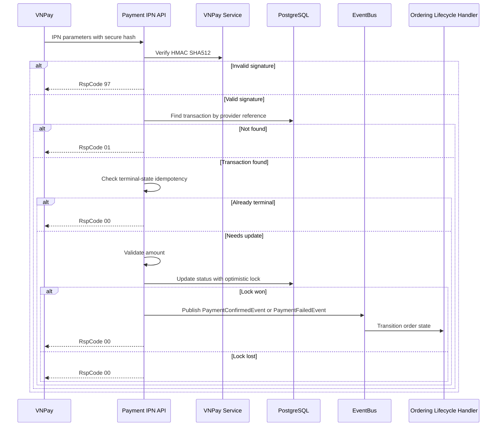
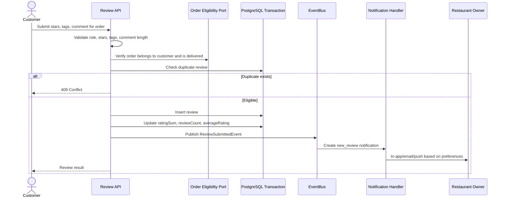

# Software Development, Operation and Maintenance Final Report

## Cover Page

| Field         | Value                                                                                                                                     |
| ------------- | ----------------------------------------------------------------------------------------------------------------------------------------- |
| Project       | SoLi Food Order and Delivery Platform                                                                                                     |
| Repository    | SoLi-Food-Order-and-Deliver-App                                                                                                           |
| Report type   | Final report for Software Development, Operation and Maintenance                                                                          |
| Prepared from | Source code, architecture documents, test artifacts, CI/CD configuration, infrastructure files, and operation documents in the repository |
| Status        | Final report artifact                                                                                                                     |

---

## Declaration

This report documents the actual state of the SoLi Food Order and Delivery Platform as implemented in the repository. It combines the business requirements, software architecture, implementation evidence, testing strategy, deployment automation, operation practices, maintenance risks, and future development direction into one final submission artifact.

The report uses existing repository documents as supporting evidence, but the implementation is treated as the source of truth when older documents are stale. One important example is UC-22 Submit Rating and Review: some earlier architecture and use-case documents describe it as planned, while the current codebase contains `ReviewModule`, `SubmitReviewHandler`, review persistence, rating aggregation, and E2E coverage. The final report therefore records UC-22 as implemented and notes the documentation mismatch as a maintenance finding.

---

## Abstract

SoLi Food is a multi-role food ordering and delivery platform for customers, restaurant partners, shippers, administrators, and platform operators. The platform supports restaurant discovery, cart management, checkout, COD and VNPay payments, order lifecycle tracking, promotions, notifications, image management, rating and review submission, admin analytics, CI/CD validation, deployment automation, and observability.

The system is implemented as a TypeScript monorepo containing a NestJS backend API, React web client, React admin panel, Expo React Native mobile app, Docker packaging, GitHub Actions workflows, Render Terraform infrastructure, and observability configuration. The backend follows a modular monolith architecture with bounded contexts, Drizzle ORM over PostgreSQL, Redis for runtime state, in-process domain events, ports and adapters, anti-corruption layer snapshots, and risk-driven unit and E2E tests.

The strongest engineering evidence is concentrated in the backend core: cart and checkout reliability, VNPay IPN integrity, order lifecycle state control, promotion reservation and rollback, notification delivery, review submission, admin analytics, health checks, telemetry, and CI validation. The report also records known gaps honestly: web/admin/mobile automated tests are placeholders, some governance and shipper workflows remain partial, rate limiting is planned rather than integrated in the NestJS app, and production observability still requires complete alert and SLO operation.

The central conclusion is that SoLi Food is a maintainable modular-monolith product with mature backend workflow design and credible operational foundations, but it requires further hardening in UI testing, production security controls, client-side real-time integration, backup/restore drills, and operational alerting before it should be considered fully production mature.

---

## Project Contribution Matrix

The final repository evidence does not contain the official student roster. The table below records contribution areas and concrete deliverables so the team can map the official names to the correct ownership rows before institutional submission.

| Official team member | Responsibility area                       | Main deliverables and evidence                                                                                                                     |
| -------------------- | ----------------------------------------- | -------------------------------------------------------------------------------------------------------------------------------------------------- |
| Member 1             | Backend ordering and lifecycle            | Cart invariants, checkout orchestration, Redis idempotency, order state machine, order history, order lifecycle tests                              |
| Member 2             | Payment and promotion                     | VNPay payment URL generation, IPN verification, payment transaction state, promotion preview/reserve/confirm/rollback, payment and promotion tests |
| Member 3             | Restaurant catalog, image, review         | Restaurant/menu/zones, Cloudinary image module, UC-22 Submit Rating and Review, rating aggregation, review E2E                                     |
| Member 4             | Notification and real-time support        | In-app notification inbox, WebSocket gateway, email and push channels, quiet hours, device token cleanup, notification tests                       |
| Member 5             | Web/admin/mobile clients                  | React web app, React admin app, Expo mobile app, API client integration, app builds, client observability hooks                                    |
| Member 6             | DevOps, testing, operation, documentation | GitHub Actions, Turbo task graph, Docker, Render/Terraform, observability docs, unit/E2E testing summaries, final report evidence review           |

---

## Table of Contents

1. Introduction and Project Context
2. Analysis: Requirements, Business Rules, and Use Cases
3. Design: Architecture, Views, Decisions, and Quality Attributes
4. Implementation Evidence
5. Testing, Verification, and Validation
6. Installation, Deployment, and CI/CD
7. Operation and Maintenance
8. Conclusion and Lessons Learned
9. Development Direction and Future Improvements  
   Appendices

---

# Chapter 1: Introduction and Project Context

## 1.1 Problem Statement

Food delivery platforms need to coordinate customers, restaurants, delivery personnel, payment providers, and operational administrators. The system must do more than list restaurants and create orders. It must preserve business rules under retry, handle payment callbacks safely, prevent duplicate orders, notify stakeholders, support review and rating aggregation, provide operational visibility, and remain maintainable as the feature set grows.

SoLi Food addresses this problem as a multi-role marketplace. The platform is scoped as an MVP for a Vietnam city or district context. It focuses on customer ordering, restaurant operations, VNPay and COD payments, order state management, notifications, review submission, and platform administration.

## 1.2 Project Objectives

The project objectives are:

| Objective                        | Explanation                                                                                                    | Evidence                                                                                                                                                           |
| -------------------------------- | -------------------------------------------------------------------------------------------------------------- | ------------------------------------------------------------------------------------------------------------------------------------------------------------------ |
| Support customer ordering        | Customers can browse restaurants, manage a cart, checkout, pay, track orders, and submit reviews               | [apps/api/src/module/ordering](../../../apps/api/src/module/ordering), [apps/api/src/module/review](../../../apps/api/src/module/review)                           |
| Support restaurant operations    | Restaurant partners can manage catalog state, availability, order acceptance, promotions, and preparation flow | [apps/api/src/module/restaurant-catalog](../../../apps/api/src/module/restaurant-catalog), [apps/api/src/module/promotion](../../../apps/api/src/module/promotion) |
| Integrate safe online payment    | VNPay IPN is verified before payment state changes and is protected by idempotency and optimistic locking      | [apps/api/src/module/payment/commands/process-ipn.handler.ts](../../../apps/api/src/module/payment/commands/process-ipn.handler.ts)                                |
| Preserve business reliability    | Checkout uses Redis locks, idempotency keys, ACL snapshots, transactions, and database uniqueness              | [apps/api/src/module/ordering/order/commands/place-order.handler.ts](../../../apps/api/src/module/ordering/order/commands/place-order.handler.ts)                  |
| Enable operation and maintenance | CI/CD, Docker, Render/Terraform, health checks, logging, telemetry, redaction, and documentation are present   | [CICD.md](../../../CICD.md), [OBSERVABILITY.md](../../../OBSERVABILITY.md), [infra/render](../../../infra/render)                                                  |

## 1.3 Stakeholders and User Roles

| Stakeholder       | Primary needs                                                                                  | Current status                                                                           |
| ----------------- | ---------------------------------------------------------------------------------------------- | ---------------------------------------------------------------------------------------- |
| Customer          | Discover food, place orders, pay, track status, receive notifications, review completed orders | Implemented for core backend flows and client surfaces                                   |
| Restaurant owner  | Manage restaurant information, menu, availability, promotions, and incoming order decisions    | Implemented for core backend flows, with governance refinements pending                  |
| Shipper           | Participate in pickup and delivery lifecycle states                                            | Partial; lifecycle states exist, full dispatch/onboarding remains future work            |
| Platform admin    | Approve partners, monitor platform metrics, govern operational state, investigate issues       | Partial; admin analytics and approvals exist, deeper governance is roadmap               |
| Platform operator | Deploy, monitor, diagnose, and maintain the system                                             | Implemented foundations with CI/CD, health checks, and telemetry; alert maturity pending |
| External provider | VNPay, Cloudinary, FCM/email providers, Grafana/Sentry/PostHog                                 | Integrated or configurable through adapters and environment variables                    |

## 1.4 Product Scope and Boundaries

The MVP scope includes:

- Customer registration, login, restaurant discovery, cart, checkout, payment, order tracking, notifications, and review submission.
- Restaurant catalog management, availability, order acceptance, preparation, promotions, and owner notifications.
- Backend support for COD and VNPay payments.
- Notification through in-app/WebSocket, email, and push-channel abstractions.
- Admin analytics, restaurant approval, health checks, CI/CD, and deployment support.

The MVP excludes or only partially supports:

- B2B enterprise orders and subscription meals.
- Microservices and distributed message brokers.
- Full shipper application workflow and automated dispatch optimization.
- Mature production SLOs, full alert coverage, load testing, and disaster recovery drills.
- Complete automated testing for web, admin, and mobile clients.

## 1.5 Repository and System Overview

The repository is a pnpm/Turborepo monorepo:

| Area           | Path                                                                                                   | Role                                                        |
| -------------- | ------------------------------------------------------------------------------------------------------ | ----------------------------------------------------------- |
| API            | [apps/api](../../../apps/api)                                                                          | NestJS backend, bounded contexts, persistence, Redis, tests |
| Web app        | [apps/web](../../../apps/web)                                                                          | React/Vite customer-facing web surface                      |
| Admin app      | [apps/admin](../../../apps/admin)                                                                      | React/Vite admin and governance surface                     |
| Mobile app     | [apps/mobile](../../../apps/mobile)                                                                    | Expo React Native mobile client                             |
| Infrastructure | [infra/render](../../../infra/render)                                                                  | Render Terraform infrastructure                             |
| Observability  | [OBSERVABILITY.md](../../../OBSERVABILITY.md), [docs/observability.md](../../../docs/observability.md) | Logging, telemetry, dashboards, secrets                     |
| CI/CD          | [.github/workflows](../../../.github/workflows), [CICD.md](../../../CICD.md)                           | Validation, packaging, deployment                           |

## 1.6 Technology Stack Summary

| Layer     | Technology                                                                                                           |
| --------- | -------------------------------------------------------------------------------------------------------------------- |
| Backend   | NestJS 11, TypeScript, CQRS, Better Auth, Drizzle ORM, PostgreSQL, Redis, Socket.IO, OpenTelemetry                   |
| Web       | React 19, Vite, React Router, TanStack Query, Axios, Base/Radix UI, Grafana Faro, PostHog                            |
| Admin     | React 19, Vite, TanStack Query, Recharts, Better Auth, UI component libraries                                        |
| Mobile    | Expo SDK 55, React Native 0.83, Expo Router, Better Auth Expo, Firebase messaging, Socket.IO client, Sentry, PostHog |
| Testing   | Jest, ts-jest, Supertest, E2E tests with PostgreSQL and Redis                                                        |
| Operation | pnpm 11.1.2, Turborepo, Docker, GHCR, GitHub Actions, Render, Terraform, Grafana Cloud, Sentry                       |

## 1.7 System Context Diagram



## 1.8 Report Method

The final report was prepared by cross-checking:

- Business documents in [apps/api/docs/Final_Documents](Final_Documents).
- Architecture documents: ASR, ADD, ADR, SAD, quality attributes, and utility tree.
- Source code in [apps/api/src](../../../apps/api/src), [apps/web/src](../../../apps/web/src), [apps/admin/src](../../../apps/admin/src), and [apps/mobile/src](../../../apps/mobile/src).
- Unit and E2E tests under [apps/api/src](../../../apps/api/src) and [apps/api/test/e2e](../../../apps/api/test/e2e).
- CI/CD workflows under [.github/workflows](../../../.github/workflows).
- Docker, Terraform, and observability configuration.

Where documents and code disagree, the final report records the current implementation state and identifies the mismatch as a maintenance issue.

---

# Chapter 2: Analysis: Requirements, Business Rules, and Use Cases

## 2.1 Business Objectives

The business goal is to create a local food delivery marketplace where customers can order from approved restaurant partners and where the platform can operate payments, delivery states, notifications, reviews, and governance with predictable rules. The system is intended to be practical rather than speculative: it favors a maintainable modular monolith, strong backend correctness, and deployable operations over premature distributed-service complexity.

## 2.2 Business Rules

| Rule | Summary                                                              | Current implementation status                                                                          |
| ---- | -------------------------------------------------------------------- | ------------------------------------------------------------------------------------------------------ |
| BR-1 | Restaurant partner approval is required before marketplace operation | Implemented through restaurant approval state and role promotion patterns; deeper KYC workflow pending |
| BR-2 | Cart can contain items from only one restaurant                      | Implemented in cart service and guarded again during checkout                                          |
| BR-3 | Delivery radius must be validated before checkout                    | Implemented through delivery zones and Haversine distance logic                                        |
| BR-4 | MVP supports COD and VNPay payments                                  | Implemented through payment method handling and VNPay IPN flow                                         |
| BR-5 | Platform commission and revenue analytics are required               | Implemented as admin analytics; commission operations can be expanded                                  |
| BR-7 | Order lifecycle must follow valid transitions                        | Implemented through closed transition table, role checks, optimistic locking, and audit logs           |
| BR-8 | Restaurant and menu availability must control ordering               | Implemented through restaurant/menu state and ordering ACL snapshots                                   |
| BR-9 | Enterprise/B2B/subscription meal flows are out of scope              | Correctly excluded from MVP                                                                            |

## 2.3 Major Use-Case Groups

| Group                                 | Examples                                               | Status                                                                   |
| ------------------------------------- | ------------------------------------------------------ | ------------------------------------------------------------------------ |
| Authentication and account management | Sign up, sign in, role-based access                    | Implemented core; social login/MFA not implemented                       |
| Restaurant discovery and catalog      | Restaurant list, menu, modifiers, zones, search        | Implemented backend and client surfaces                                  |
| Cart and checkout                     | Add/update/remove cart items, place order, idempotency | Implemented and unit/E2E tested                                          |
| Order lifecycle                       | Confirm, prepare, pickup, deliver, cancel, audit       | Implemented backend state machine                                        |
| Payment                               | VNPay redirect, IPN, COD, payment timeout              | Implemented for payment creation/IPN; refund request integration partial |
| Promotion                             | Preview, reserve, confirm, rollback                    | Implemented backend workflows                                            |
| Notification                          | In-app, email, push, unread count, delivery logs       | Implemented backend; client live integration partial                     |
| Review and rating                     | Submit review, validate eligibility, aggregate rating  | Implemented; older docs are stale                                        |
| Administration                        | Approvals, analytics, operational governance           | Partial; admin analytics present, full governance roadmap remains        |

## 2.4 Use Case Diagram



## 2.5 Representative Use Cases

### UC-8 Place Order

The place-order use case is the most important business transaction. It starts from a Redis-backed cart and ends with an order aggregate, order items, order status log, optional VNPay payment URL, promotion reservation confirmation, cart cleanup, and `OrderPlacedEvent`. The implementation shows strong reliability tactics: checkout lock, idempotency key, ACL snapshots, transaction, database uniqueness, and post-commit events.

### UC-9 VNPay Payment Confirmation

VNPay IPN is the authoritative payment confirmation path. The handler verifies HMAC SHA512 before database lookup or mutation, validates amount, handles terminal-state retries, updates payment status with optimistic locking, and publishes payment events only after the winning state transition.

### UC-22 Submit Rating and Review

The review use case validates that the order exists, belongs to the customer, has been delivered, has not already been reviewed, and satisfies input constraints. The transaction inserts the review and updates restaurant rating aggregate fields. After commit, `ReviewSubmittedEvent` triggers notification behavior. This is implemented in current source code even though some older documents mark it planned.

### Notification Delivery

The notification use case bridges domain events to user-facing delivery channels. It persists notification records, checks preferences and quiet hours, dispatches in-app/email/push channels, logs delivery attempts, emits WebSocket events, and invalidates unread-count cache.

### Admin Governance

Admin governance is partially implemented. The platform supports approval state, role checks, order status audit logs, and analytics. Shipper application workflow, full role-refresh strategy after administrative role changes, and richer governance dashboards remain maintenance backlog items.

## 2.6 Requirements Traceability Snapshot

| Requirement theme                  | Implementation evidence                                                                               | Verification evidence                                       |
| ---------------------------------- | ----------------------------------------------------------------------------------------------------- | ----------------------------------------------------------- |
| Single-restaurant cart             | [apps/api/src/module/ordering/cart](../../../apps/api/src/module/ordering/cart)                       | `cart.service.spec.ts`, `cart.e2e-spec.ts`                  |
| Retry-safe checkout                | [place-order.handler.ts](../../../apps/api/src/module/ordering/order/commands/place-order.handler.ts) | `place-order.handler.spec.ts`, `order.e2e-spec.ts`          |
| Payment integrity                  | [process-ipn.handler.ts](../../../apps/api/src/module/payment/commands/process-ipn.handler.ts)        | `process-ipn.handler.spec.ts`, `payment-phase8.e2e-spec.ts` |
| Order lifecycle correctness        | [transitions.ts](../../../apps/api/src/module/ordering/order-lifecycle/constants/transitions.ts)      | `transitions.spec.ts`, `order-lifecycle.e2e-spec.ts`        |
| Review eligibility and aggregation | [submit-review.handler.ts](../../../apps/api/src/module/review/commands/submit-review.handler.ts)     | `review.e2e-spec.ts`                                        |
| Notification delivery              | [apps/api/src/module/notification](../../../apps/api/src/module/notification)                         | notification service specs and E2E notification specs       |
| Operation readiness                | [CICD.md](../../../CICD.md), [OBSERVABILITY.md](../../../OBSERVABILITY.md)                            | workflow validation, health endpoints, telemetry tests      |

---

# Chapter 3: Design: Architecture, Views, Decisions, and Quality Attributes

## 3.1 Architecture Style

SoLi Food uses a modular monolith. The system is deployed as one NestJS backend process, but the code is organized around bounded contexts and explicit integration boundaries. This decision fits the project because it preserves domain structure without introducing the operational overhead of microservices, distributed transactions, service discovery, message brokers, and multi-service CI/CD.

The architecture is not a simple layered CRUD monolith. It contains domain-focused modules, command handlers for high-risk writes, event handlers, ports and adapters, ACL snapshots, Redis runtime state, and explicit persistence ownership. This gives the system a path toward future extraction while keeping MVP deployment manageable.

## 3.2 Five Primary Views

| View             | Purpose                                                | Report evidence                                               |
| ---------------- | ------------------------------------------------------ | ------------------------------------------------------------- |
| Context View     | Shows actors, platform boundary, and external systems  | Chapter 1 system context diagram                              |
| Logical View     | Shows bounded contexts and collaborations              | AppModule, module roots, domain events, ports                 |
| Data View        | Shows durable state, transient state, and ownership    | Drizzle schema, PostgreSQL tables, Redis keys, ACL snapshots  |
| Development View | Shows repository organization and validation contracts | pnpm workspace, Turborepo, tests, workflows                   |
| Deployment View  | Shows runtime topology and operations                  | Docker, GHCR, Render, Terraform, health checks, observability |

## 3.3 Logical View



The main bounded contexts are Auth, Restaurant Catalog, Image, Ordering, Payment, Promotion, Notification, Review, and Admin Analytics. `AppModule` imports these modules and core infrastructure modules such as Database, Redis, Geo, Schedule, and Auth.

## 3.4 Data View

PostgreSQL is the durable source of truth. Drizzle ORM provides type-safe schema definitions, query construction, and migration support. Redis is used for runtime state where expiration, fast access, and operational transience are appropriate.

| Data category           | Storage    | Examples                                                                                                      | Reason                                                                    |
| ----------------------- | ---------- | ------------------------------------------------------------------------------------------------------------- | ------------------------------------------------------------------------- |
| Durable business data   | PostgreSQL | users, restaurants, menu items, orders, order items, payment transactions, promotions, reviews, notifications | Requires auditability and consistency                                     |
| Runtime state           | Redis      | carts, checkout locks, idempotency keys, WebSocket presence, unread cache                                     | Requires TTL, atomic operations, and fast access                          |
| Cross-context snapshots | PostgreSQL | ordering restaurant snapshots, menu item snapshots, delivery zone snapshots                                   | Allows Ordering to validate checkout without direct Catalog service reads |
| External media          | Cloudinary | restaurant and menu images                                                                                    | Avoids storing binary image data inside the database                      |

The ACL snapshot pattern is a key design decision. Ordering reads local snapshots when placing an order, instead of calling Restaurant Catalog services inside the checkout transaction. This reduces coupling and makes checkout behavior more stable.

## 3.5 Development View

The repository is organized for team development:

- `pnpm-workspace.yaml` defines workspace packages.
- `turbo.json` defines build, lint, typecheck, test, and E2E task dependencies.
- `apps/api` contains NestJS modules, tests, Dockerfile, Drizzle configuration, and docs.
- `apps/web`, `apps/admin`, and `apps/mobile` contain client applications.
- `.github/workflows` contains CI/CD and package/deploy automation.
- `infra/render` contains Render Terraform infrastructure.

The backend development view uses command handlers for complex writes and services for simpler operations. High-risk workflows such as checkout, VNPay IPN, order transition, and review submission are isolated into handlers that can be unit tested.

## 3.6 Deployment View



Deployment is based on Docker images, GitHub Actions validation, GHCR image publication, Render deploy hooks, and Terraform-managed Render infrastructure shape. The final deployment depends on correctly configured secrets and environment variables.

## 3.7 Mandatory Sequence Diagram 1: Place Order



## 3.8 Mandatory Sequence Diagram 2: VNPay Payment Confirmation



## 3.9 Mandatory Sequence Diagram 3: Submit Rating and Review



## 3.10 Official Architecture Decision Records

| ADR     | Decision                                   | Consequences                                                                                |
| ------- | ------------------------------------------ | ------------------------------------------------------------------------------------------- |
| ADR-001 | Adopt Modular Monolith Architecture        | One deployable, strong domain boundaries, simpler operations, future extraction possible    |
| ADR-003 | Use Database per BC Ownership              | One PostgreSQL instance with logical ownership, table groups, and module-scoped access      |
| ADR-004 | Use In-process EventBus Communication      | Low operational overhead, simple domain events, broker migration possible later             |
| ADR-005 | Adopt ACL Snapshot Pattern                 | Ordering avoids direct runtime reads from Restaurant Catalog during checkout                |
| ADR-006 | Use Redis Runtime Layer                    | Efficient cart, lock, idempotency, presence, and cache state with TTL semantics             |
| ADR-007 | Use Ports and Adapters Integration Pattern | Ordering depends on stable contracts rather than concrete Payment/Promotion implementations |
| ADR-008 | Adopt Drizzle Type-safe Persistence Layer  | Type-safe SQL, migration-friendly schema, transaction-oriented data access                  |

## 3.11 Significant Engineering Decisions

| ID    | Decision                     | Evidence                                                                                                                                   |
| ----- | ---------------------------- | ------------------------------------------------------------------------------------------------------------------------------------------ |
| SD-01 | NestJS + TypeScript backend  | [apps/api/package.json](../../../apps/api/package.json), [apps/api/src/app.module.ts](../../../apps/api/src/app.module.ts)                 |
| SD-02 | Hybrid CQRS strategy         | Place order, transition order, process IPN, submit review command handlers                                                                 |
| SD-03 | Risk-driven testing strategy | [UNIT_TESTING_IMPLEMENTATION_SUMMARY.md](../../../UNIT_TESTING_IMPLEMENTATION_SUMMARY.md), [apps/api/test/e2e](../../../apps/api/test/e2e) |
| SD-04 | CI/CD strategy               | [.github/workflows](../../../.github/workflows), [turbo.json](../../../turbo.json), [CICD.md](../../../CICD.md)                            |
| SD-05 | Observability strategy       | [OBSERVABILITY.md](../../../OBSERVABILITY.md), [apps/api/src/observability](../../../apps/api/src/observability)                           |

## 3.12 Quality Attribute: Maintainability

| Scenario field | Detail                                                                                                  |
| -------------- | ------------------------------------------------------------------------------------------------------- |
| Source         | A new workflow such as Submit Rating and Review is added after core ordering exists                     |
| Stimulus       | The team adds a cross-context feature requiring order eligibility, rating aggregation, and notification |
| Response       | Implement a new bounded context using ports/events without rewriting checkout                           |
| Evidence       | `ReviewModule`, `ORDER_ELIGIBILITY_PORT`, `SubmitReviewHandler`, `ReviewSubmittedEvent`                 |

Maintainability is achieved through bounded contexts, module ownership, command handlers, dependency injection tokens, and event-based collaboration. The trade-off is that boundaries depend on development discipline because all modules still live inside one process.

## 3.13 Quality Attribute: Testability

| Scenario field | Detail                                                                        |
| -------------- | ----------------------------------------------------------------------------- |
| Source         | A pull request changes checkout, payment IPN, or review behavior              |
| Stimulus       | The team must validate correctness before merge                               |
| Response       | Run unit tests for handlers/services and E2E tests with real PostgreSQL/Redis |
| Evidence       | 34 API unit spec files, 18 API E2E suites, `ci-validate.yml`                  |

The backend uses dependency injection, mocks for handler dependencies, real AppModule E2E tests, and deterministic test helpers. The major gap is client-side automated testing: web, admin, and mobile package scripts currently state that no tests are configured.

## 3.14 Quality Attribute: Reliability

| Scenario field | Detail                                                                                                                 |
| -------------- | ---------------------------------------------------------------------------------------------------------------------- |
| Source         | Customer retries checkout or VNPay retries IPN                                                                         |
| Stimulus       | Duplicate requests arrive due to network failures or provider retry behavior                                           |
| Response       | Idempotency keys, checkout locks, terminal-state checks, optimistic locking, and DB uniqueness prevent duplicate state |
| Evidence       | `PlaceOrderHandler`, `ProcessIpnHandler`, order/payment tests                                                          |

Reliability is one of the strongest implementation areas. Checkout protects against duplicate clicks and retry races. Payment IPN protects against repeated provider callbacks and concurrent handlers. The trade-off is operational dependence on Redis for fast runtime guarantees.

## 3.15 Quality Attribute: Manageability

| Scenario field | Detail                                                                                                   |
| -------------- | -------------------------------------------------------------------------------------------------------- |
| Source         | Operators/admins need to control orders, partners, releases, and configuration                           |
| Stimulus       | A release, approval, order intervention, or incident occurs                                              |
| Response       | Admin role checks, analytics, state machine, audit logs, environment validation, CI/CD, health endpoints |
| Evidence       | Admin analytics service, order status logs, workflows, health controller                                 |

Manageability is partially achieved. The platform has release automation, health endpoints, analytics, and role checks. Full governance workflows such as shipper application review and role-refresh after admin role changes require further implementation.

## 3.16 Quality Attribute: Flexibility

| Scenario field | Detail                                                                                    |
| -------------- | ----------------------------------------------------------------------------------------- |
| Source         | The platform needs to change providers or add new integrations                            |
| Stimulus       | Add MoMo/ZaloPay, change email provider, adjust promotion rules, replace image storage    |
| Response       | Use ports, provider interfaces, and adapters                                              |
| Evidence       | Payment initiation port, promotion application port, notification providers, image module |

The architecture achieves partial flexibility. Ordering does not import concrete Payment or Promotion services, but the payment initiation port is currently VNPay-specific. Adding more payment providers without touching Ordering requires generalizing the port contract.

## 3.17 Quality Attribute: Supportability

| Scenario field | Detail                                                                                                            |
| -------------- | ----------------------------------------------------------------------------------------------------------------- |
| Source         | A production issue happens in payment, order status, review, or notification                                      |
| Stimulus       | Developers need to reconstruct what happened                                                                      |
| Response       | Preserve state history, structured logs, request IDs, payment transactions, notification delivery logs, and tests |
| Evidence       | `order_status_logs`, `payment_transactions`, notification delivery logs, JSON logger, observability docs          |

Supportability is strong for backend core workflows. The next improvements are backup/restore exercises, richer admin audit queries, alert policies, and incident playbooks with owner responsibilities.

## 3.18 Quality Attribute: Operability

| Scenario field | Detail                                                                                                        |
| -------------- | ------------------------------------------------------------------------------------------------------------- |
| Source         | The team deploys and monitors API, web, admin, mobile, database, Redis, and providers                         |
| Stimulus       | A release or incident requires operational confidence                                                         |
| Response       | CI/CD workflows, Docker images, GHCR, Render deploy hooks, Terraform, health endpoints, telemetry, dashboards |
| Evidence       | `CICD.md`, workflows, Dockerfiles, `infra/render`, observability docs, Grafana dashboard JSON                 |

Operability is implemented as a foundation, not as a completed production SLO program. Telemetry is configurable and health checks exist, but production alert coverage, load testing, and multi-instance validation remain future work.

---

# Chapter 4: Implementation Evidence

## 4.1 Backend Module Registry

The backend module registry in [apps/api/src/app.module.ts](../../../apps/api/src/app.module.ts) imports the core infrastructure and bounded contexts: Database, Redis, Geo, Schedule, Restaurant Catalog, Promotion, Admin Analytics, Ordering, Payment, Notification, Image, Review, and Better Auth. This confirms that the architecture is implemented as real modules rather than only described in documents.

## 4.2 Restaurant Catalog and ACL Projection

Restaurant Catalog owns restaurant, menu, modifier, and delivery-zone data. Ordering receives projected snapshots through ACL projectors. This design allows checkout to validate menu item status, restaurant approval/open state, modifiers, and delivery zones from local snapshot tables.

Implementation evidence:

- [apps/api/src/module/restaurant-catalog](../../../apps/api/src/module/restaurant-catalog)
- [apps/api/src/module/ordering/acl](../../../apps/api/src/module/ordering/acl)
- [apps/api/src/shared/events](../../../apps/api/src/shared/events)

## 4.3 Cart and Checkout Workflow

The checkout workflow is implemented in [apps/api/src/module/ordering/order/commands/place-order.handler.ts](../../../apps/api/src/module/ordering/order/commands/place-order.handler.ts). It includes:

1. Redis idempotency lookup.
2. Redis checkout lock.
3. Redis cart load.
4. Bulk ACL snapshot reads.
5. Restaurant and item validation.
6. Delivery-zone resolution.
7. Price re-snapshot and total computation.
8. Promotion reservation.
9. Optional VNPay payment initiation.
10. Database transaction for order, order items, and status log.
11. Promotion confirmation.
12. Idempotency result persistence before cleanup.
13. Cart cleanup, lock release, and `OrderPlacedEvent` publishing.

This workflow is a central example of reliability, maintainability, and testability.

## 4.4 Order Lifecycle State Machine

The order lifecycle is controlled by a closed transition table in [apps/api/src/module/ordering/order-lifecycle/constants/transitions.ts](../../../apps/api/src/module/ordering/order-lifecycle/constants/transitions.ts) and implemented through transition command handlers. Transitions enforce actor roles, ownership, notes for certain actions, shipper restrictions, refund-triggering transitions, optimistic locking, and audit log insertion.

The state machine supports transitions such as pending, paid, confirmed, preparing, ready_for_pickup, picked_up, delivering, delivered, cancelled, refund_pending, refunded, and failed/timeout cases.

## 4.5 VNPay Payment Workflow

Payment implementation is centered around VNPay URL generation, transaction persistence, IPN confirmation, timeout handling, and refund state support. The most security-sensitive flow is [apps/api/src/module/payment/commands/process-ipn.handler.ts](../../../apps/api/src/module/payment/commands/process-ipn.handler.ts).

Key behaviors:

- HMAC SHA512 verification before database mutation.
- Constant-time comparison in VNPay signature verification.
- Amount validation against stored transaction.
- Terminal-state idempotency for VNPay retries.
- Optimistic locking for concurrent IPN protection.
- Event publishing after successful state change.

Refund integration is partial: the refund state machine is present, but real external VNPay refund request integration remains a future hardening task.

## 4.6 Promotion Engine and Checkout Integration

Promotion logic is implemented through pricing rules, preview, reservation, confirmation, and rollback. The promotion application port allows checkout to use promotion behavior without depending on concrete implementation details.

Implementation evidence:

- [apps/api/src/module/promotion](../../../apps/api/src/module/promotion)
- [apps/api/src/shared/ports/promotion-application.port.ts](../../../apps/api/src/shared/ports/promotion-application.port.ts)

The reservation journal prevents double redemption and supports rollback during order cancellation or payment failure.

## 4.7 Notification Multi-Channel Delivery

The notification module supports in-app, email, and push-channel delivery. It includes preferences, quiet hours, delivery logs, device token cleanup, WebSocket delivery, and Redis unread cache invalidation.

Implementation evidence:

- [apps/api/src/module/notification](../../../apps/api/src/module/notification)
- [apps/api/src/module/notification/gateway/notification.gateway.ts](../../../apps/api/src/module/notification/gateway/notification.gateway.ts)
- [apps/api/src/module/notification/services/notification.service.ts](../../../apps/api/src/module/notification/services/notification.service.ts)

The architecture is flexible because channel providers can be changed or disabled without blocking core order/payment/review workflows. Noop/stub behavior also helps CI avoid real external provider side effects.

## 4.8 Submit Rating and Review

UC-22 is implemented in [apps/api/src/module/review](../../../apps/api/src/module/review). The review handler verifies order eligibility through a port, prevents duplicate reviews, validates stars/tags/comment, inserts the review, updates restaurant rating aggregation, and publishes an event for owner notification.

This workflow is especially important because it demonstrates requirements-to-code traceability and reveals a documentation maintenance issue: some older docs mark review as planned, but current code and E2E tests show it is implemented.

## 4.9 Admin Analytics and Governance

Admin analytics computes platform metrics such as GMV, order counts, success rate, restaurant status counts, hourly load, top earners, bottlenecks, and district-level order distribution. It supports operational visibility, but full governance is not complete.

Implemented:

- Admin-only analytics endpoint and service.
- Restaurant approval patterns.
- Role checks on protected endpoints.
- Order status logs.

Partial or planned:

- Formal shipper application workflow.
- Immediate session role refresh after admin role changes.
- Deeper audit dashboard and report export.

## 4.10 Web, Admin, and Mobile Surfaces

The client applications exist as functional surfaces:

- [apps/web](../../../apps/web): React/Vite customer web app with API client, routing, forms, maps, and observability hooks.
- [apps/admin](../../../apps/admin): React/Vite admin app with React Query, Recharts, and admin UI dependencies.
- [apps/mobile](../../../apps/mobile): Expo/React Native app with Better Auth Expo, React Query, Firebase messaging, Socket.IO client, Sentry, and PostHog.

Their build, lint, and typecheck scripts exist. Their test scripts currently echo that no tests are configured, so automated client behavior validation is a maintenance priority.

## 4.11 Infrastructure and Configuration

Infrastructure implementation includes:

- Dockerfiles for API, web, admin, and development variants.
- Local PostgreSQL and Redis via Docker Compose.
- Render Terraform under [infra/render](../../../infra/render).
- GitHub Actions workflows for PR validation, app pipelines, Docker packaging, mobile packaging, Render image promotion, and Render IaC.
- Observability docs and dashboard configuration.

---

# Chapter 5: Testing, Verification, and Validation

## 5.1 Testing Strategy Overview

The project uses a risk-driven test strategy. Instead of claiming complete coverage of every file, the team prioritized modules where regressions would cause the most damage: security, payment, money math, checkout, cart invariants, order state transitions, promotion reservation, notifications, review submission, and observability.

## 5.2 Unit Test Evidence

The documented unit testing summary records 504 passing tests across 33 suites at the time of that summary. The current repository search shows 34 API unit spec files, including an additional environment schema spec. The report therefore uses the conservative statement that the backend has a documented passing baseline of 504 tests across 33 suites, with current source inventory showing 34 spec files.

Important tested areas:

- RBAC utility and role matching.
- VNPay signing and signature verification.
- Order lifecycle transition table and transition handler.
- Cart service invariants.
- PlaceOrderHandler checkout orchestration.
- ProcessIpnHandler payment confirmation.
- Payment service transaction lifecycle.
- Promotion pricing and reservation behavior.
- Notification services and channels.
- Observability configuration, redaction, request context, and route telemetry.

## 5.3 E2E Test Evidence

The repository contains 18 E2E suites under [apps/api/test/e2e](../../../apps/api/test/e2e):

| E2E suite                        | Main coverage                                   |
| -------------------------------- | ----------------------------------------------- |
| `acl.e2e-spec.ts`                | ACL projection and cross-context integrity      |
| `cart.e2e-spec.ts`               | Redis cart operations and constraints           |
| `menu.e2e-spec.ts`               | Menu query behavior                             |
| `modifiers.e2e-spec.ts`          | Modifier groups and options                     |
| `notification-inbox.e2e-spec.ts` | Notification inbox and unread behavior          |
| `notification-n4.e2e-spec.ts`    | Multi-channel notification behavior             |
| `observability.e2e-spec.ts`      | Telemetry/logging behavior                      |
| `order-history.e2e-spec.ts`      | Customer/restaurant/shipper/admin order queries |
| `order-lifecycle.e2e-spec.ts`    | State machine and lifecycle flows               |
| `order.e2e-spec.ts`              | Order placement and retrieval                   |
| `payment-phase8.e2e-spec.ts`     | VNPay IPN, idempotency, signatures              |
| `promotion-checkout.e2e-spec.ts` | Promotion checkout integration                  |
| `promotion-pr1-pr2.e2e-spec.ts`  | Promotion CRUD and coupon management            |
| `restaurant.e2e-spec.ts`         | Restaurant creation, approval, edit, list       |
| `review.e2e-spec.ts`             | UC-22 review submission and aggregation         |
| `search.e2e-spec.ts`             | Restaurant search                               |
| `spec-e2e.e2e-spec.ts`           | Baseline app and health checks                  |
| `zones.e2e-spec.ts`              | Delivery zone behavior                          |

These tests use a real NestJS app, PostgreSQL, Redis, HTTP interactions, and test auth helpers. This makes them stronger than isolated route mocks for validating cross-module behavior.

## 5.4 CI Validation

The CI validation workflow performs lint, typecheck, audit, unit test, build, database push, and E2E validation. Workflows include:

- [pr-master-validate.yml](../../../.github/workflows/pr-master-validate.yml)
- [pipeline-api.yml](../../../.github/workflows/pipeline-api.yml)
- [pipeline-web.yml](../../../.github/workflows/pipeline-web.yml)
- [pipeline-admin.yml](../../../.github/workflows/pipeline-admin.yml)
- [pipeline-mobile.yml](../../../.github/workflows/pipeline-mobile.yml)
- [ci-validate.yml](../../../.github/workflows/ci-validate.yml)
- [cd-package-docker.yml](../../../.github/workflows/cd-package-docker.yml)
- [cd-package-mobile.yml](../../../.github/workflows/cd-package-mobile.yml)
- [cd-render-image.yml](../../../.github/workflows/cd-render-image.yml)
- [cd-render-iac.yml](../../../.github/workflows/cd-render-iac.yml)

## 5.5 Defect Analysis and Recent Fixes

Two recent defects are useful maintenance examples:

| Defect                              | Root cause                                                                                                                      | Correct fix                                                       |
| ----------------------------------- | ------------------------------------------------------------------------------------------------------------------------------- | ----------------------------------------------------------------- |
| PlaceOrderHandler unit test failure | A mock for cart deletion returned `undefined` while production code treated the method as Promise-like                          | Preserve async mock semantics by returning `Promise.resolve()`    |
| UC-22 RV-110 E2E failure            | Notification lookup found an older `new_review` notification for the same owner, causing `4 sao` instead of the current `5 sao` | Query by `orderId` in addition to notification type and recipient |

These fixes show two lessons: mocks must preserve production contracts, and E2E tests with shared state must select by unique business identifiers.

## 5.6 Testing Gaps

Known gaps:

- Web app tests are not configured.
- Admin app tests are not configured.
- Mobile app tests are not configured.
- Some backend controllers and repositories are intentionally left to integration/E2E coverage rather than unit mocks.
- Notification gateway and some client real-time behaviors need more direct automated validation.
- Full load testing and chaos/failure testing are not yet part of CI.

## 5.7 Verification Quality Gate

| Gate                                                | Status | Notes                                                               |
| --------------------------------------------------- | ------ | ------------------------------------------------------------------- |
| Backend lint/typecheck/build scripts exist          | PASS   | API package contains scripts                                        |
| API unit tests exist for critical domains           | PASS   | Documented 504 tests/33 suites; current inventory has 34 spec files |
| API E2E tests cover major workflows                 | PASS   | 18 E2E suites found                                                 |
| Web/admin/mobile lint/typecheck/build scripts exist | PASS   | Scripts present in package files                                    |
| Web/admin/mobile automated tests                    | GAP    | Scripts currently echo no tests configured                          |
| CI/CD workflows present                             | PASS   | 10 workflow files found                                             |
| Production SLO/alert evidence                       | GAP    | Telemetry configured; alert maturity pending                        |

---

# Chapter 6: Installation, Deployment, and CI/CD

## 6.1 Prerequisites

The project requires:

- Node.js 22 for CI and local development alignment.
- pnpm 11.1.2.
- PostgreSQL 18.
- Redis 7 or compatible Redis/Valkey runtime.
- Environment variables for Better Auth, database, Redis, VNPay, Cloudinary, notification providers, and observability.
- Docker for local service dependencies and production image builds.

## 6.2 Local Installation Flow

Typical local setup:

```bash
pnpm install --frozen-lockfile
docker compose up -d
pnpm --filter api db:push
pnpm --filter api dev
pnpm --filter web dev
pnpm --filter admin dev
pnpm --filter mobile dev
```

The exact environment values must be supplied through `.env` or CI secrets. The API validates environment shape through the configuration schema.

## 6.3 Runtime Dependencies

| Dependency             | Purpose                                                                           |
| ---------------------- | --------------------------------------------------------------------------------- |
| PostgreSQL             | Durable business data, transactions, audit records, payment transactions, reviews |
| Redis                  | Cart state, checkout lock, idempotency keys, WebSocket presence, unread cache     |
| VNPay                  | Online payment redirect and IPN confirmation                                      |
| Cloudinary             | Image storage and CDN                                                             |
| SMTP/FCM               | Email and push notifications                                                      |
| Grafana/Sentry/PostHog | Telemetry, errors, product analytics                                              |

## 6.4 Turborepo Task Graph

The Turborepo configuration defines build, lint, test, typecheck, E2E, and development tasks. Environment variables in `globalEnv` invalidate cache for runtime-sensitive configuration such as database URLs, Redis URL, Better Auth secrets, VNPay secrets, OTEL settings, Sentry settings, Faro settings, PostHog settings, and Expo public variables.

## 6.5 GitHub Actions Workflow Inventory

| Workflow                 | Purpose                                    |
| ------------------------ | ------------------------------------------ |
| `pr-master-validate.yml` | Pull request validation to master          |
| `pipeline-api.yml`       | API validation, package, deploy path       |
| `pipeline-web.yml`       | Web validation, package, deploy path       |
| `pipeline-admin.yml`     | Admin validation, package, deploy path     |
| `pipeline-mobile.yml`    | Mobile validation and mobile package build |
| `ci-validate.yml`        | Reusable CI validation with services       |
| `cd-package-docker.yml`  | Docker build and GHCR image publication    |
| `cd-package-mobile.yml`  | Mobile packaging workflow                  |
| `cd-render-image.yml`    | Render image deploy hook                   |
| `cd-render-iac.yml`      | Render Terraform/IaC workflow              |

## 6.6 Docker and Image Packaging

Dockerfiles package the API, web, and admin applications. Images are published to GHCR and promoted to Render using deploy hooks. This separates image packaging from infrastructure provisioning and avoids mixing Terraform resource ownership with application image promotion.

## 6.7 Render and Terraform Deployment

Terraform under [infra/render](../../../infra/render) defines Render service shape, database resources, variables, outputs, and provider configuration. The infrastructure files show an intended deployment model where application services consume managed PostgreSQL and runtime configuration through Render environment variables and secrets.

Important operation note: Terraform intentionally ignores some secret-file changes, so the Render dashboard and CI secrets remain part of the operational process. This should be documented as a security and configuration management practice.

## 6.8 Health Checks

The API exposes:

- `GET /api/ready`: checks Redis and PostgreSQL readiness.
- `GET /api/live`: returns process liveness and uptime.
- `GET /api/health`: readiness alias.

The readiness endpoint returns service-unavailable status when Redis or PostgreSQL fails. This is enough for basic platform health checks, but it does not validate every business workflow.

## 6.9 Rollback Strategy

Rollback is based on:

- Re-promoting a known good GHCR image tag.
- Keeping database migrations controlled and reviewed.
- Avoiding destructive migrations without backup.
- Using health checks to detect failed deploys.
- Inspecting Render logs and telemetry after deployment.

The roadmap should add formal rollback drills, migration dry-runs, and restore tests.

---

# Chapter 7: Operation and Maintenance

## 7.1 Operational Model

The operation model combines CI validation, Docker packaging, managed hosting, health checks, telemetry, structured logs, redaction, and documented runbooks. The platform is maintainable because runtime behavior is visible and because high-risk backend workflows leave durable evidence in database state and logs.

## 7.2 Logging and Telemetry

The API includes OpenTelemetry instrumentation and structured JSON logging. Observability features include:

- Request context and request IDs.
- Route grouping for telemetry.
- Domain spans such as order placement and payment verification.
- Metrics hooks for domain events.
- Redaction for sensitive fields such as auth headers, cookies, tokens, payment signatures, and IP-like values.
- Grafana Cloud OTLP export configuration.

Web uses Grafana Faro and PostHog. Mobile uses Sentry and PostHog. These integrations improve issue detection and user-behavior visibility, but they require production secrets and dashboard/alert operations.

## 7.3 Monitoring and Health

Current monitoring foundations:

- Render logs.
- API readiness and liveness endpoints.
- OpenTelemetry traces, logs, and metrics export configuration.
- Grafana dashboard JSON.
- Sentry for mobile errors.
- Faro for web errors and web vitals.

Maintenance gap: full production alerts, SLO definitions, stuck-order dashboards, and escalation policy are not yet fully evidenced.

## 7.4 Incident Runbook

| Incident                     | First checks                                                               | Follow-up                                                       |
| ---------------------------- | -------------------------------------------------------------------------- | --------------------------------------------------------------- |
| API unavailable              | `/api/live`, `/api/ready`, Render service status, logs                     | Check database and Redis, rollback image if deploy-related      |
| Checkout failure             | API logs by request ID, Redis state, order rows, promotion reservations    | Check cart lock/idempotency behavior, inspect E2E regression    |
| VNPay mismatch               | IPN logs, payment transaction status, secure hash verification, amount     | Reconcile VNPay dashboard and local payment transaction         |
| Missing notification         | Notification row, delivery logs, preferences, quiet hours, provider errors | Re-dispatch if safe, inspect channel provider health            |
| Review notification mismatch | Review row, orderId, notification query, owner recipient                   | Use orderId-scoped lookup to avoid stale/shared-state confusion |

## 7.5 Backup and Recovery

The architecture depends on PostgreSQL for durable data and Redis for runtime state. A production plan should include:

- Managed PostgreSQL backup schedule.
- Restore rehearsal for orders, payments, reviews, and notifications.
- Redis failure handling documentation.
- Export of critical audit trails before destructive changes.
- Verification of migration rollback plans.

The current repository contains infrastructure shape but not a completed backup/restore drill record.

## 7.6 Maintainability Mechanisms

| Mechanism          | Benefit                                         |
| ------------------ | ----------------------------------------------- |
| Bounded contexts   | Limits feature impact and clarifies ownership   |
| Ports and adapters | Reduces concrete cross-context coupling         |
| ACL snapshots      | Protects checkout from catalog runtime coupling |
| Command handlers   | Makes high-risk writes testable and auditable   |
| Event handlers     | Decouples side effects from core transactions   |
| Drizzle schema     | Keeps persistence typed and migration-aware     |
| Unit and E2E tests | Detects regressions in critical workflows       |
| CI/CD workflows    | Enforces lint/typecheck/test/build gates        |

## 7.7 Known Maintenance Risks

| Risk                                        | Impact                                              | Recommended action                                                            |
| ------------------------------------------- | --------------------------------------------------- | ----------------------------------------------------------------------------- |
| Web/admin/mobile have no automated tests    | Client regressions can pass CI                      | Add Vitest/React Testing Library, Playwright, and Detox or Expo test strategy |
| Rate limiting not integrated in NestJS      | Public endpoint abuse risk                          | Add edge throttling or Redis-backed `@nestjs/throttler`                       |
| Client real-time integration partial        | Users may not see immediate updates on all surfaces | Complete socket and polling integration for web/admin/mobile                  |
| Shipper workflow partial                    | Delivery operations remain manual or incomplete     | Add shipper application, assignment, and dispatch flows                       |
| Role refresh after admin updates incomplete | Changed roles may require re-login                  | Add session cache invalidation or token refresh strategy                      |
| Refund provider integration partial         | Refund operations may require manual handling       | Implement real VNPay refund request and callbacks                             |
| Alerting and SLOs incomplete                | Incidents may be noticed late                       | Define SLOs, Grafana alerts, on-call runbooks                                 |
| Backup/restore drills absent                | Data recovery confidence is low                     | Schedule restore rehearsals and document evidence                             |

## 7.8 Maintenance Backlog

Priority backlog:

1. Add web/admin/mobile automated test coverage.
2. Add production rate limiting.
3. Complete client real-time notification and order-status integration.
4. Implement formal shipper onboarding and dispatch.
5. Implement role-refresh/session invalidation after admin role changes.
6. Complete VNPay refund request integration.
7. Add Grafana alerts and stuck-order dashboards.
8. Add backup/restore and migration rollback drills.
9. Add load testing and multi-instance WebSocket validation.
10. Generalize payment port for multiple payment providers.

---

# Chapter 8: Conclusion and Lessons Learned

## 8.1 Delivered Capabilities

The project delivers a working multi-role food delivery platform with a strong backend core. The most mature capabilities are:

- Modular NestJS backend with bounded contexts.
- Redis-backed cart, checkout lock, and idempotency.
- PostgreSQL/Drizzle persistence and transaction-oriented workflows.
- ACL snapshots for checkout safety.
- VNPay IPN verification, idempotency, and optimistic locking.
- Promotion preview/reserve/confirm/rollback.
- Notification delivery through in-app, email, and push abstractions.
- UC-22 review submission and rating aggregation.
- Order lifecycle state machine and audit logs.
- API unit and E2E tests for critical workflows.
- CI/CD workflows, Docker packaging, Render deployment shape, and observability foundations.

## 8.2 Technical Lessons Learned

### Architecture Lessons Learned

The modular monolith was the correct architecture for this project stage. It gave the team domain boundaries without the complexity of microservices. The main lesson is that boundaries still require discipline: modules must use ports, events, and snapshots rather than reaching into each other's internals.

### Development Lessons Learned

CQRS-style command handlers are valuable for high-risk writes. Checkout, IPN processing, order transitions, and review submission are easier to understand and test when the workflow is centralized in one handler. Simpler CRUD operations do not always need the same structure.

### Testing Lessons Learned

Tests must preserve production contracts. The async Promise mock issue in `PlaceOrderHandler` showed that a unit test can fail or misrepresent behavior when mocks do not match real return types. The RV-110 E2E issue showed that shared E2E state requires precise identifiers such as `orderId`.

### Operation Lessons Learned

CI/CD and observability are part of software quality, not optional documentation. Health checks, environment validation, Docker images, workflow gates, request IDs, telemetry, and redaction make the project easier to operate and defend.

### Maintenance Lessons Learned

Documentation becomes stale unless it is reviewed against source code. UC-22 was the clearest example: older docs marked review as planned, but code and tests show it is implemented. Final reporting should treat source code, tests, and workflows as active evidence and record documentation drift explicitly.

## 8.3 Engineering Lessons Learned

| Lesson                                 | Example                                                                           | Future behavior                                    |
| -------------------------------------- | --------------------------------------------------------------------------------- | -------------------------------------------------- |
| Do not overclaim readiness             | Client tests and alerting are incomplete                                          | Mark gaps honestly and convert them into backlog   |
| Protect money flows first              | VNPay IPN uses signature verification, amount check, idempotency, optimistic lock | Keep payment changes behind strong tests           |
| Use unique business identifiers in E2E | Review notification query must include `orderId`                                  | Design tests to be deterministic under shared data |
| Keep side effects isolated             | Notification and refund handlers should not break core transactions               | Make handlers idempotent and observable            |
| Prefer evidence over assumptions       | Read source, tests, workflows, and docs before final claims                       | Maintain traceability tables in future reports     |

## 8.4 Demonstration Package

Recommended lecturer demonstration flow:

1. Show repository structure and AppModule bounded contexts.
2. Demonstrate customer cart and checkout.
3. Demonstrate VNPay payment URL and IPN behavior through tests or controlled sandbox.
4. Demonstrate order lifecycle transition and audit log.
5. Demonstrate Submit Rating and Review, including owner notification.
6. Show unit and E2E test inventory.
7. Show CI/CD workflows, Docker packaging, and health endpoints.
8. Show observability configuration and redaction strategy.
9. Close with the maintenance backlog and roadmap.

---

# Chapter 9: Development Direction and Future Improvements

## 9.1 Product Roadmap

Future product work should focus on:

- Full shipper onboarding, approval, assignment, and dispatch.
- Real-time delivery tracking with map updates.
- Richer admin governance and audit dashboards.
- Review moderation and abuse prevention.
- Loyalty, wallet, and advanced promotion mechanisms.
- Additional payment providers such as MoMo or ZaloPay after payment port generalization.

## 9.2 Technical Improvements

Technical roadmap:

| Improvement                        | Reason                                                                         |
| ---------------------------------- | ------------------------------------------------------------------------------ |
| Generalize payment initiation port | Add providers without changing Ordering logic                                  |
| Add NestJS or edge rate limiting   | Protect public endpoints                                                       |
| Add outbox or broker when needed   | Improve event reliability if deployment becomes multi-instance and high volume |
| Add Redis-backed Socket.IO adapter | Support WebSocket fan-out across multiple API instances                        |
| Expand observability dashboards    | Improve incident detection and debugging                                       |
| Add backup/restore automation      | Improve recovery confidence                                                    |

## 9.3 Testing Roadmap

Testing improvements:

- Add Vitest and React Testing Library for web and admin.
- Add Playwright for browser E2E flows.
- Add mobile component and integration tests for Expo flows.
- Add contract tests for API/client payload compatibility.
- Add load tests for checkout, payment callback, search, and notification fan-out.
- Add failure-injection tests for Redis, provider timeouts, and duplicate IPN storms.

## 9.4 Operations Roadmap

Operations improvements:

- Define SLOs for checkout, payment IPN, order status propagation, and notification delivery.
- Add Grafana alerts for error rate, latency, failed IPN, stuck orders, Redis failures, and database saturation.
- Add incident severity levels and escalation ownership.
- Run restore drills and record evidence.
- Validate deployment rollback with real image tags.
- Verify web `/healthz` behavior and Render health check configuration.

## 9.5 Scaling Direction

The current architecture should scale first as a modular monolith by adding stateless API instances, shared PostgreSQL, shared Redis, and load-balanced clients. Before extracting microservices, the team should add a Redis-backed Socket.IO adapter, outbox/event reliability, explicit module boundary checks, provider contract tests, and operational dashboards. Microservice extraction should happen only for modules with clear independent scaling, ownership, and deployment needs.

## 9.6 Final Statement

SoLi Food demonstrates a credible software development, operation, and maintenance lifecycle. It has a well-structured backend, real business workflows, meaningful tests, deployment automation, and observability foundations. Its remaining work is not hidden: UI test automation, production security hardening, alert maturity, backup/recovery drills, real-time client completion, and deeper governance should be the next investment areas.

---

# Appendices

## Appendix A: Evidence File Manifest

| Category                       | Files                                                                                                                                             |
| ------------------------------ | ------------------------------------------------------------------------------------------------------------------------------------------------- |
| Business and architecture docs | [apps/api/docs/Final_Documents](Final_Documents)                                                                                                  |
| Report proposal                | [SOFTWARE_DEVELOPMENT_OPERATION_MAINTENANCE_REPORT_PROPOSAL.md](SOFTWARE_DEVELOPMENT_OPERATION_MAINTENANCE_REPORT_PROPOSAL.md)                    |
| API module registry            | [apps/api/src/app.module.ts](../../../apps/api/src/app.module.ts)                                                                                 |
| Checkout                       | [apps/api/src/module/ordering/order/commands/place-order.handler.ts](../../../apps/api/src/module/ordering/order/commands/place-order.handler.ts) |
| VNPay IPN                      | [apps/api/src/module/payment/commands/process-ipn.handler.ts](../../../apps/api/src/module/payment/commands/process-ipn.handler.ts)               |
| Review                         | [apps/api/src/module/review](../../../apps/api/src/module/review)                                                                                 |
| Notification                   | [apps/api/src/module/notification](../../../apps/api/src/module/notification)                                                                     |
| Unit testing summary           | [UNIT_TESTING_IMPLEMENTATION_SUMMARY.md](../../../UNIT_TESTING_IMPLEMENTATION_SUMMARY.md)                                                         |
| API E2E tests                  | [apps/api/test/e2e](../../../apps/api/test/e2e)                                                                                                   |
| CI/CD                          | [.github/workflows](../../../.github/workflows), [CICD.md](../../../CICD.md)                                                                      |
| Observability                  | [OBSERVABILITY.md](../../../OBSERVABILITY.md), [docs/observability.md](../../../docs/observability.md)                                            |
| Infrastructure                 | [infra/render](../../../infra/render)                                                                                                             |

## Appendix B: Final Quality Gate

| Required item                                                          | Status |
| ---------------------------------------------------------------------- | ------ |
| Created as final report, not proposal or summary                       | PASS   |
| Based on current proposal blueprint                                    | PASS   |
| Re-grounded in implementation evidence                                 | PASS   |
| Includes Project Contribution Matrix                                   | PASS   |
| Includes System Context Diagram                                        | PASS   |
| Includes analysis chapter                                              | PASS   |
| Includes architecture and five views                                   | PASS   |
| Includes Place Order sequence                                          | PASS   |
| Includes VNPay Payment Confirmation sequence                           | PASS   |
| Includes Submit Rating and Review sequence                             | PASS   |
| Includes ADR-001, ADR-003, ADR-004, ADR-005, ADR-006, ADR-007, ADR-008 | PASS   |
| Includes SD-01, SD-02, SD-03, SD-04, SD-05                             | PASS   |
| Includes Maintainability                                               | PASS   |
| Includes Testability                                                   | PASS   |
| Includes Reliability                                                   | PASS   |
| Includes Manageability                                                 | PASS   |
| Includes Flexibility                                                   | PASS   |
| Includes Supportability                                                | PASS   |
| Includes Operability                                                   | PASS   |
| Includes testing chapter with unit and E2E evidence                    | PASS   |
| Includes installation and deployment chapter                           | PASS   |
| Includes operation and maintenance chapter                             | PASS   |
| Includes Technical Lessons Learned                                     | PASS   |
| Includes Engineering Lessons Learned                                   | PASS   |
| Includes Development Direction and Future Improvements                 | PASS   |
| Avoids overclaiming frontend/mobile test maturity                      | PASS   |
| Corrects UC-22 review implementation status                            | PASS   |

## Appendix C: Abbreviations

| Term  | Meaning                                                   |
| ----- | --------------------------------------------------------- |
| ACL   | Anti-Corruption Layer                                     |
| ADD   | Attribute-Driven Design                                   |
| ADR   | Architecture Decision Record                              |
| API   | Application Programming Interface                         |
| ASR   | Architecturally Significant Requirement                   |
| BC    | Bounded Context                                           |
| CI/CD | Continuous Integration and Continuous Delivery/Deployment |
| CQRS  | Command Query Responsibility Segregation                  |
| E2E   | End to End                                                |
| FCM   | Firebase Cloud Messaging                                  |
| GHCR  | GitHub Container Registry                                 |
| IPN   | Instant Payment Notification                              |
| OTEL  | OpenTelemetry                                             |
| SAD   | Software Architecture Document                            |
| SLO   | Service Level Objective                                   |
| SRS   | Software Requirements Specification                       |
| VNPay | Vietnamese payment gateway used by the platform           |
