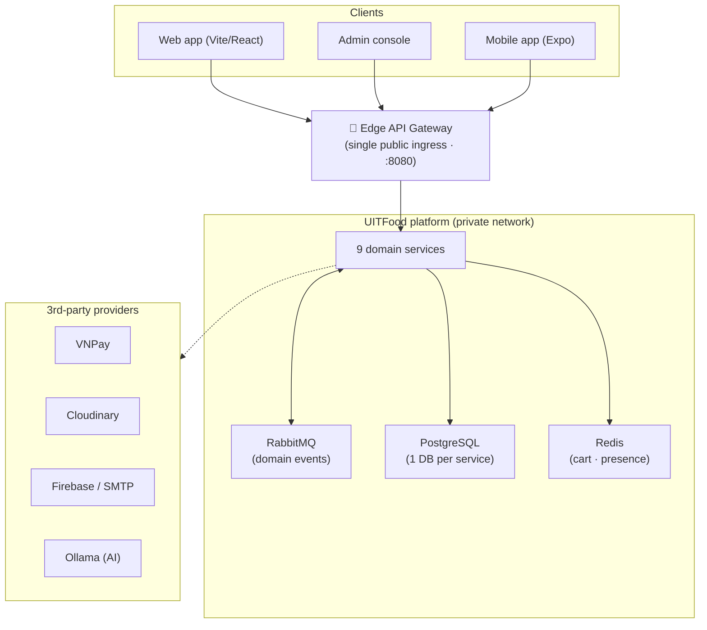
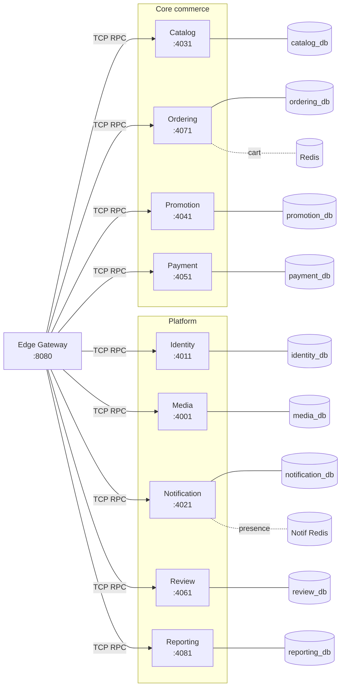
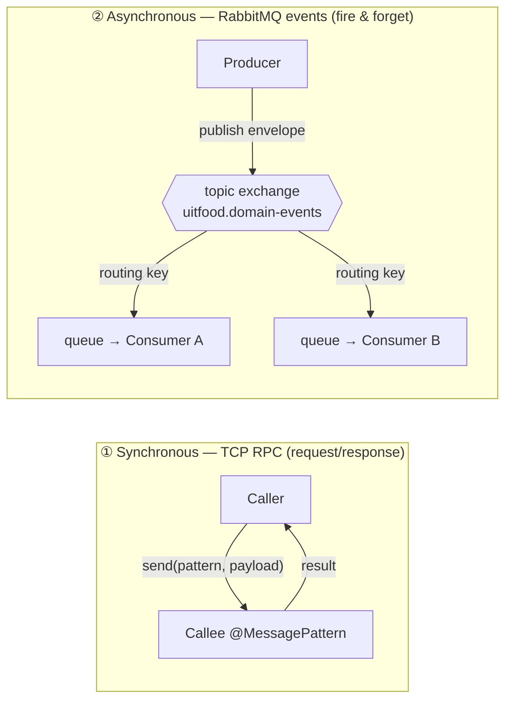
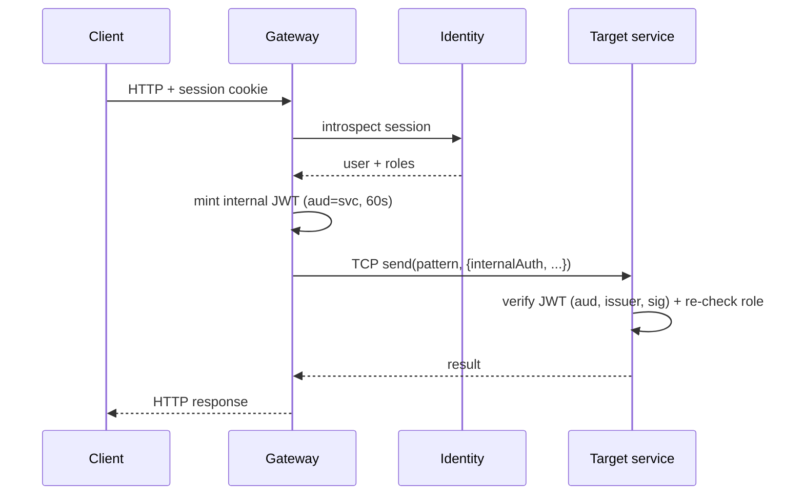
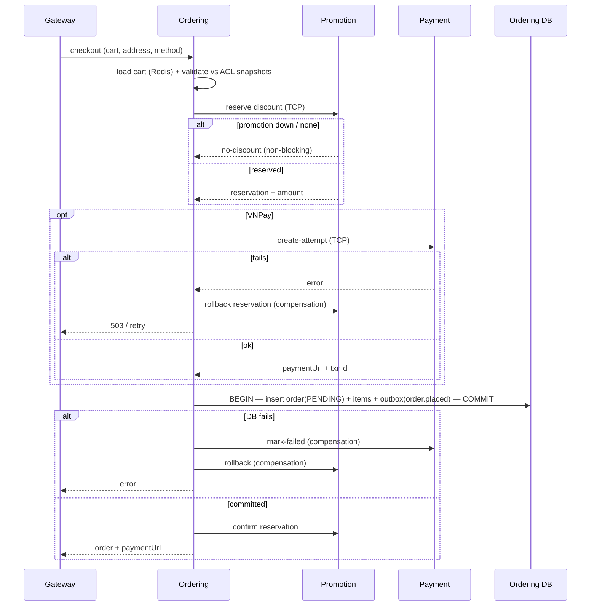
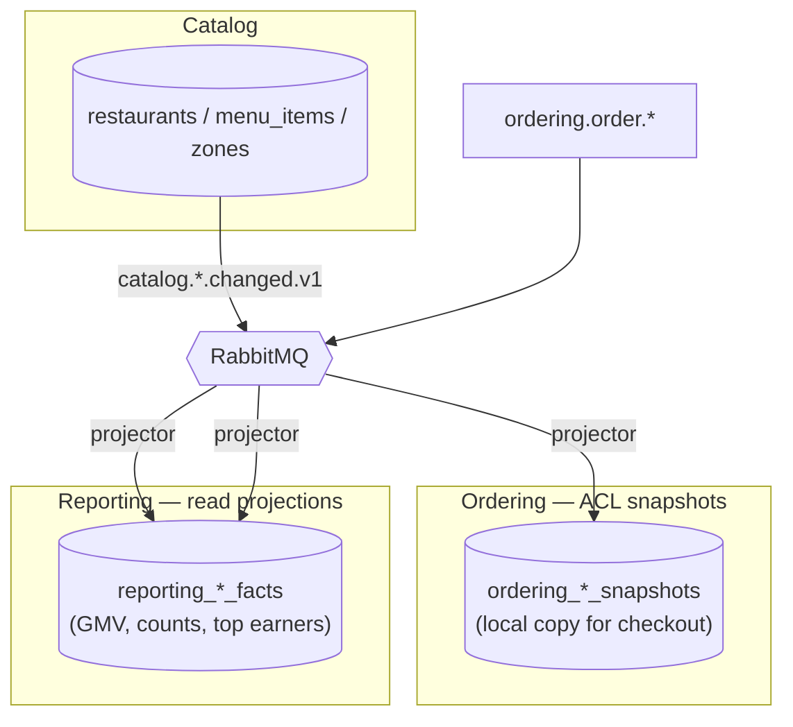
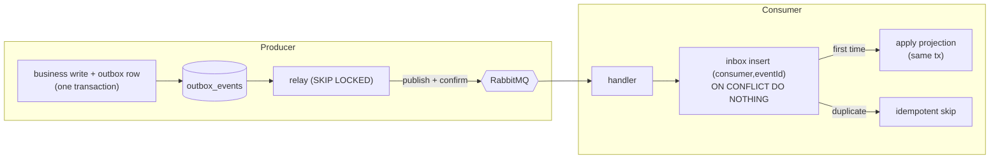
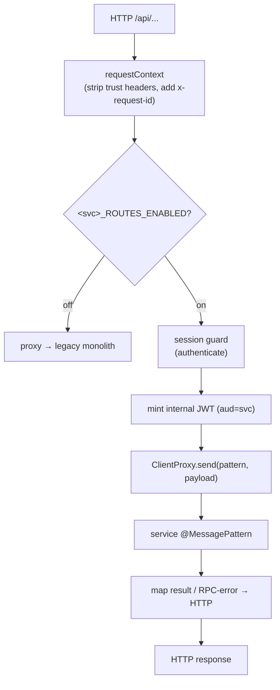
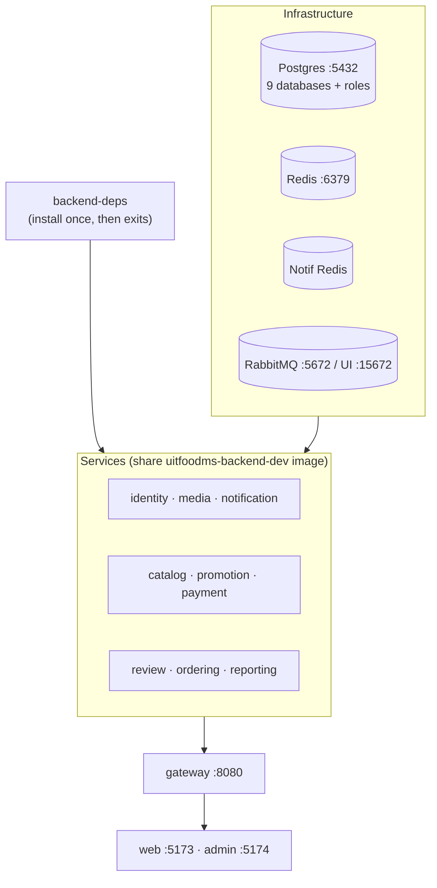

# UITFood — Microservices Architecture

> A food-ordering & delivery platform, migrated from a NestJS **modular monolith**
> into **nine independently deployable services** behind an edge API gateway,
> using the Strangler Fig pattern. This document explains the architecture, the
> communication model, the data-ownership rules, and the key patterns — with
> diagrams.

- **Runtime:** NestJS 11 (TypeScript), Node 22/24
- **Datastores:** PostgreSQL 18 (pgvector) — *database-per-service*; Redis (cart + presence)
- **Messaging:** RabbitMQ topic exchange (`uitfood.domain-events`)
- **Sync transport:** Nest microservice **TCP RPC** (`@MessagePattern` / `ClientProxy`)
- **Edge:** a single API Gateway (the only public ingress)

---

## 1. System context

The public surface is a **single door** — the Edge Gateway. Browsers, the admin
console, and the mobile app never talk to a service directly; they talk to the
gateway, which routes each request to the owning service. External providers
(VNPay, Cloudinary, FCM, SMTP, Ollama) are reached only by the specific service
that owns that capability.



---

## 2. Service topology

Nine services, each owning a bounded context, its own database, and a port pair
(**TCP** for RPC + **management HTTP** for `/live` `/ready`). The gateway holds a
TCP client to every service.



| Service | Owns | TCP / mgmt | Sync deps | Consumes events |
|---|---|---|---|---|
| **Identity** | users, sessions, roles (Better Auth) | 4011 / 4012 | — | — |
| **Media** | image metadata, Cloudinary signing | 4001 / 4002 | — | — |
| **Notification** | inbox, email, push, WebSocket | 4021 / 4022 | Identity | ordering.\*, payment.\*, review.\*, catalog.\*, identity.\* |
| **Catalog** | restaurants, menus, modifiers, zones, search (pgvector) | 4031 / 4032 | Media, Identity | review.submitted |
| **Promotion** | promotions, coupons, usage reservations | 4041 / 4042 | — | — |
| **Payment** | VNPay attempts, IPN, refunds | 4051 / 4052 | — | ordering.order-cancelled-after-payment |
| **Review** | reviews & ratings | 4061 / 4062 | Ordering (eligibility) | — |
| **Ordering** | carts, orders, lifecycle, history, ACL snapshots | 4071 / 4072 | Promotion, Payment | catalog.\*, payment.\*, review.\* |
| **Reporting** | analytics projections | 4081 / 4082 | — | ordering.\*, catalog.restaurant.\* |

---

## 3. Two communication styles

Services never share a database and never make cross-service SQL joins. They
integrate in exactly two ways:



- **Synchronous TCP RPC** — used when the caller needs an **answer now** and the
  outcome affects the current request (e.g. checkout must reserve a promotion and
  create a payment attempt before committing). Contracts live in
  `@uitfood/contracts` as versioned `*_RPC_PATTERNS` + Zod schemas.
- **Asynchronous events** — used to **propagate facts** after they happen, with no
  caller waiting (e.g. "an order was placed"). Producers write to a
  **transactional outbox** and a relay publishes to RabbitMQ; consumers dedupe via
  an **inbox**. This is what keeps services decoupled and independently available.

### Security: internal JWT on every hop
The gateway authenticates the external session (Better Auth) and mints a
**short-lived internal JWT** scoped to the target service (`aud=catalog`, etc.).
Services verify it and re-check ownership/roles — they never trust raw headers.
Service-to-service calls (e.g. Ordering→Payment) present a `service:*` token.



---

## 4. The checkout saga (the hardest workflow)

Placing an order spans **three services** with no distributed transaction.
Ordering runs an **orchestrated saga** with explicit **compensation**: each step
that can leave a side effect has an "undo" that runs if a later step fails.



The **payment result** arrives later, asynchronously: the customer pays, VNPay
calls Payment's IPN, Payment publishes `payment.confirmed.v1` /
`payment.failed.v1`, and Ordering's bridge transitions the order
`PENDING → PAID` (or `→ CANCELLED`).

**Key guarantees**
- The order row and its `order.placed` event are written in **one DB transaction**
  (transactional outbox) — they can never diverge.
- Promotion is **non-blocking**: if it's down, checkout proceeds without a
  discount rather than failing.
- Compensations are **fire-and-forget & idempotent** — they never block the flow.

---

## 5. Data ownership & the two ACL patterns

Every service owns its tables. When a service needs *another* context's data, it
keeps a **local, event-fed copy** — never a query across a boundary.



- **Ordering ACL snapshots** — Ordering keeps read-only snapshots of restaurants,
  menu items, and delivery zones, updated from `catalog.*.changed.v1`. Checkout
  validates and prices **entirely from these snapshots**, so it works even if
  Catalog is temporarily down (Phase-9 exit criterion).
- **Reporting projections** — the old admin-analytics did cross-context SQL joins
  over Ordering + Catalog tables. Reporting instead maintains its own
  read-optimized **fact tables** from `ordering.*` and `catalog.restaurant.changed`
  events. It **never** queries another service's DB; intra-service joins on its own
  facts are fine.

### Transactional outbox / inbox (exactly-once *in effect*)



This replaced the monolith's cross-context DB transaction: instead of one
transaction spanning three modules, **each service applies its own change
idempotently, driven by the event** — which is what makes the split databases
possible.

---

## 6. Request lifecycle through the gateway

The gateway is thin: authenticate → mint token → translate HTTP to a TCP pattern →
map the RPC result/errors back to HTTP. Each route group is guarded by a
**cutover flag** (Strangler Fig) that decides whether the gateway owns the route
or proxies it to the legacy monolith.



> **Strangler Fig:** every prior phase *copied* a module into a service behind a
> `*_ROUTES_ENABLED` flag (default `false` = still served by the monolith). Flipping
> the flag per service, after backfilling its database, cuts traffic over one
> bounded context at a time — no big-bang release. In the full local stack all flags
> are on, so the gateway owns everything and the monolith isn't needed.

---

## 7. Local deployment (Docker Compose)

Locally the fleet runs via `docker-compose.dev.yml`. A one-shot **`backend-deps`**
container installs the shared monorepo dependencies once; all backend services
reuse that image + node_modules volumes. Postgres runs an init script that creates
**one database + login role per service**.



**Start it:**
```bash
docker compose -f docker-compose.dev.yml up -d --build
```
- **Web** → http://localhost:5173 · **Admin** → http://localhost:5174
- **API** → http://localhost:8080 · **RabbitMQ** → http://localhost:15672

> Give it 3–5 min on first boot (shared dep install + per-service migrations).
> Each service migrates its own database on startup. A fresh `down -v` re-creates
> all per-service databases via the init script.

---

## 8. Why microservices here — trade-offs

| Gained | Cost |
|---|---|
| Independent deploy, scale, and ownership per context | An orchestrator is required to run locally (Compose) |
| Fault isolation — Promotion/Reporting down ≠ checkout down | Eventual consistency between services (projections lag) |
| Database-per-service (no shared-schema coupling) | Data is duplicated (snapshots/projections) and must be kept in sync via events |
| Clear contracts (`@uitfood/contracts`) | More moving parts: 9 services + gateway + broker + N databases |
| Strangler cutover — migrate one context at a time | Cross-context workflows become sagas with compensation |

**Design rules that keep it sane**
1. **No shared database, no cross-service JOINs** — own your data; consume events for the rest.
2. **Sync only when the answer changes the current request**; otherwise emit an event.
3. **Every event is idempotent** (outbox + inbox) so replays/reorders converge.
4. **The gateway is the only public door**; internal auth on every hop.
5. **Contracts are versioned** (`*.v1`) and live in one shared package.

---

## 9. Where to look in the code

| Concern | Location |
|---|---|
| Shared contracts (RPC patterns, event schemas, internal JWT) | `packages/contracts/src` |
| Edge gateway (routes, guards, TCP clients, proxy) | `apps/gateway/src` |
| A service (domain + RPC + messaging + drizzle) | `apps/services/<name>/src` |
| Checkout saga | `apps/services/ordering/src/ordering/order/commands/place-order.handler.ts` |
| Ordering ACL snapshot projectors | `apps/services/ordering/src/ordering/acl` |
| Reporting projections + consumers | `apps/services/reporting/src/reporting` |
| Outbox / inbox / RabbitMQ | `apps/services/<name>/src/messaging` |
| Phase-by-phase migration history | `apps/api/docs/PHASE_*_REPORT.md`, `apps/api/docs/MICROSERVICES_MIGRATION_PLAN.md` |
