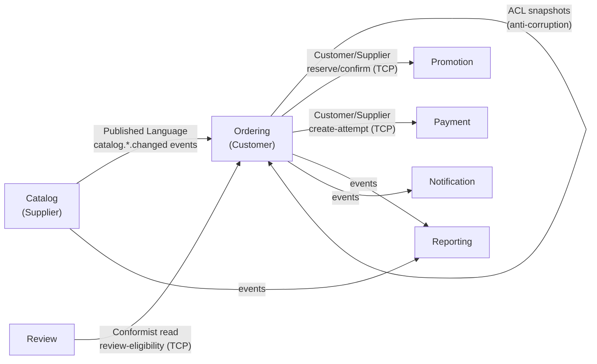
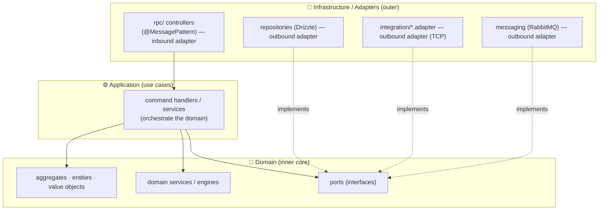
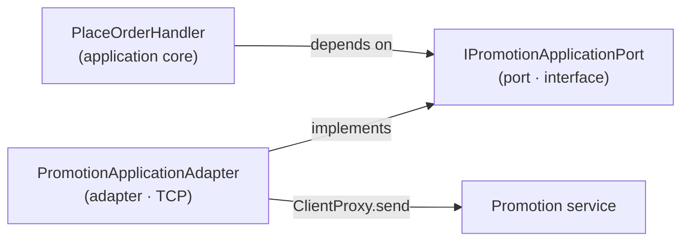
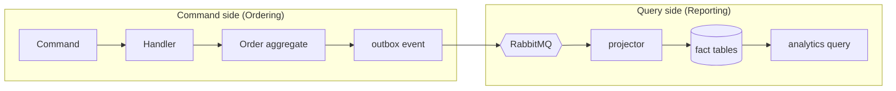
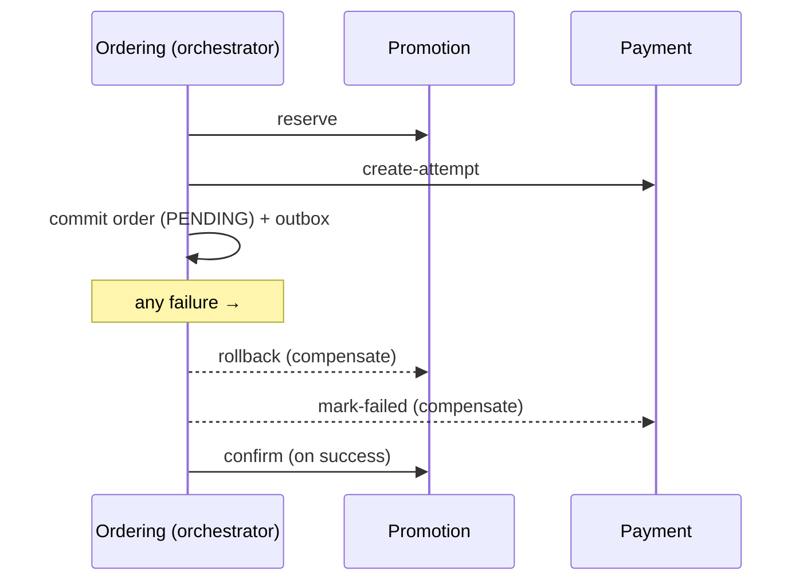

# UITFood — Design Patterns & Architectural Style

Which established patterns the project follows, **where each one lives in the
code**, and *why*. The system deliberately combines three families:

1. **Domain-Driven Design (DDD)** — strategic (bounded contexts) + tactical (aggregates, ports, domain events)
2. **Clean / Hexagonal Architecture** — ports & adapters, the dependency rule
3. **Microservices integration patterns** — API Gateway, Saga, Outbox/Inbox, CQRS, Strangler Fig

Pairs with [ARCHITECTURE.md](./ARCHITECTURE.md), [TECHNICAL_SOLUTION.md](./TECHNICAL_SOLUTION.md),
and [PROJECT_STRUCTURE.md](./PROJECT_STRUCTURE.md).

---

## 1. Domain-Driven Design — Strategic

The whole migration was driven by DDD's strategic tools: the system was split
along **bounded contexts**, not technical layers.

### Bounded Contexts
Each service **is** a bounded context with its own model, ubiquitous language,
and database. "Order", "Restaurant", "Payment" mean something precise *inside*
their context and are never shared as one big model.

| Bounded Context | Ubiquitous language (sample) |
|---|---|
| Identity | user, session, role, account |
| Catalog | restaurant, menu item, modifier group, delivery zone |
| Ordering | cart, order, line item, lifecycle transition, snapshot |
| Promotion | promotion, coupon, reservation, discount |
| Payment | attempt, IPN, refund, transaction |
| Review | review, rating, eligibility |
| Notification | inbox message, channel, device token |
| Media | image, upload signature |
| Reporting | fact, projection, GMV, bottleneck |

### Context Map (relationships between contexts)



- **Published Language** — events in `@uitfood/contracts` are the shared,
  versioned language between contexts (`ordering.order.placed.v1`).
- **Customer/Supplier** — Ordering (customer) depends on Promotion & Payment
  (suppliers) via explicit TCP contracts.
- **Anti-Corruption Layer** — Ordering never adopts Catalog's model; it translates
  `catalog.*.changed` events into its *own* snapshot shape.

### Anti-Corruption Layer (ACL)
`apps/services/ordering/src/ordering/acl/` — projectors consume Catalog events and
maintain `ordering_*_snapshots`. Checkout reads only these local snapshots, so
Ordering's model is insulated from Catalog's and works even if Catalog is down.

---

## 2. Domain-Driven Design — Tactical

Inside a context, the tactical building blocks:

| DDD building block | In this codebase |
|---|---|
| **Aggregate root** | `Order` (`ordering/order/order.schema.ts`), `Cart`, `Promotion`, `Restaurant`, `PaymentTransaction` — the consistency boundary; you mutate the root, not children directly |
| **Entity** | order items, coupon codes, modifier options (identity within an aggregate) |
| **Value Object** | delivery address, money/VND amounts, discount breakdown, cart fingerprint |
| **Domain Service** | `PromotionPricingEngine` (pure discount math), `NutritionCalculatorService`, `OrderLifecycleService` (state-machine rules) — logic that doesn't belong to a single entity |
| **Repository** | `*.repository.ts` per aggregate (`promotion.repository.ts`, `order.repository.ts`) — collection-like access over Drizzle |
| **Domain Event** | `order.placed.v1`, `payment.confirmed.v1`, `catalog.restaurant.changed.v1` — facts other contexts react to |
| **Factory** | pre-generated aggregate IDs + `createEnvelope()` for events |

> **Pure domain logic is isolated.** `PromotionPricingEngine` is a plain class with
> no NestJS, no DB, no I/O — just cart numbers → discount. That's the DDD ideal:
> the domain doesn't depend on infrastructure.

---

## 3. Clean / Hexagonal Architecture (Ports & Adapters)

Each service is layered so that **dependencies point inward** — infrastructure
depends on the domain, never the reverse (the Dependency Rule).



### Ports (the interfaces the core owns)
`apps/services/ordering/src/shared/ports/`:
- `promotion-application.port.ts` — *"I need to reserve/confirm/rollback a discount"*
- `payment-initiation.port.ts` — *"I need to create/fail a payment attempt"*
- `order-eligibility.port.ts` — *"can this customer review this order?"*

The domain (checkout) depends on the **interface**, not on any concrete service.

### Adapters (the implementations)
`apps/services/ordering/src/integration/`:
- `promotion-application.adapter.ts` — implements the port by calling the
  **Promotion service over TCP**.
- `payment-initiation.adapter.ts` — implements the port by calling **Payment**.



**Why this matters:** the checkout handler is unchanged whether Promotion is
in-process (monolith) or remote (microservice) — you just swap the adapter. This
**Dependency Inversion** is exactly what made the strangler migration possible:
each context was extracted by replacing a local adapter with a TCP one, leaving
the domain untouched.

---

## 4. CQRS (Command Query Responsibility Segregation)

Reads and writes are separated where it pays off.

- **Command side** — Ordering uses NestJS CQRS: `PlaceOrderCommand` →
  `PlaceOrderHandler`, `TransitionOrderCommand` → `TransitionOrderHandler`, plus
  event handlers (`payment-confirmed.handler`, `promotion-rollback-on-cancellation.handler`).
  Writes go through explicit, testable command handlers.
- **Query side / Read Model** — **Reporting** is a pure read model: it builds
  denormalized **projection tables** (`reporting_*_facts`) from events and serves
  analytics from them, never touching another service's write model. This is CQRS
  taken across a service boundary.



---

## 5. Microservices integration patterns

| Pattern | What & where |
|---|---|
| **API Gateway** | `apps/gateway` — single ingress; auth, routing, HTTP↔TCP translation |
| **Saga (orchestration) + Compensation** | `place-order.handler.ts` — reserve → create-attempt → commit, with `rollback`/`mark-failed` undo steps |
| **Transactional Outbox** | `messaging/outbox` — business write + event in one DB tx; relay publishes |
| **Inbox / Idempotent Consumer** | `messaging/inbox` — dedupe by `(consumer, eventId)` |
| **Materialized View / Read-Model Projection** | Ordering ACL snapshots + Reporting fact tables |
| **Database per Service** | one Postgres DB + role per service (`infra/postgres/init-test-db.sql`) |
| **Strangler Fig** | `*_ROUTES_ENABLED` gateway flags — cut over one context at a time |
| **Graceful degradation** | Promotion is non-blocking at checkout (no-discount fallback) — a lightweight bulkhead |
| **Correlation ID** | `x-request-id` propagated from the gateway through RPC + events |

### The Saga shape



---

## 6. Pattern → code map (quick reference)

| Pattern | Primary location |
|---|---|
| Bounded Context | each `apps/services/<svc>` |
| Anti-Corruption Layer | `services/ordering/src/ordering/acl` |
| Aggregate / Repository | `<svc>/src/<domain>/{domain,repositories}` |
| Domain Service (pure) | `promotion/.../engine/promotion-pricing-engine.ts` |
| Ports (interfaces) | `services/<svc>/src/shared/ports` |
| Adapters (impl) | `services/ordering/src/integration/*.adapter.ts` |
| CQRS command side | `services/ordering/src/ordering/**/commands` |
| CQRS read model | `services/reporting/src/reporting/{consumers,projections}` |
| Domain Events / Published Language | `packages/contracts/src/events` |
| Outbox / Inbox | `services/<svc>/src/messaging/{outbox,inbox}` |
| Saga + compensation | `.../order/commands/place-order.handler.ts` |
| API Gateway | `apps/gateway/src` |
| Strangler Fig flags | `apps/gateway/src/config/env.schema.ts` |

---

## 7. What we deliberately did **not** do

Being explicit about non-patterns is as useful as the patterns themselves:

- **No Event Sourcing.** Services store current state (Drizzle tables) and *emit*
  events; they don't rebuild state by replaying an event log. Reporting/ACL are
  **projections**, not an event store. (Simpler, and enough for this domain.)
- **No shared database / no cross-service JOINs.** The one rule that keeps contexts
  independent. Cross-context data is replicated via events.
- **No distributed 2-phase commit.** Consistency across services is achieved with
  the saga + outbox/inbox (eventual consistency), not distributed transactions.
- **No anemic-domain shortcut for the hard parts.** Pricing, lifecycle transitions,
  and checkout rules live in domain services/engines, not scattered in controllers.
- **No service-per-table over-splitting.** Contexts are grouped by *business*
  cohesion (e.g. cart+order+lifecycle+history+ACL all live in Ordering), per DDD —
  not one microservice per database table.

---

## 8. Vertical Slice Architecture — where we do and don't apply it

**Vertical Slice Architecture (VSA)** organizes code by **feature / use-case**
("vertical slices") instead of by **technical layer** ("horizontal layers"). Each
slice holds *everything* one use-case needs — request, handler, validation, data
access, response — so a change to a feature touches one place. It deliberately
**minimizes shared abstractions between slices** ("couple within a slice, decouple
between slices") and is usually paired with CQRS + a mediator.

```text
Layered / Clean (horizontal)        Vertical Slice (vertical)
────────────────────────────        ─────────────────────────
controllers/  services/             features/
  spread a feature across             PlaceOrder/   ← request + handler +
  every layer folder                    handler        validation + data + response
                                      CancelOrder/     all live together
```

### Verdict: **influenced by VSA, but not a Vertical Slice Architecture.**
The project is **feature-oriented on the outside, layered on the inside** — a
DDD + Hexagonal + CQRS design that borrows VSA's *command-per-use-case* slicing
but keeps shared layers (the opposite of VSA's "avoid shared abstractions").

| Level | VSA? | Why |
|---|---|---|
| **Service split (9 contexts)** | ❌ No | That's DDD *strategic* boundaries. VSA slices *within* one app; microservices ≠ VSA. |
| **Feature-grouped folders** | ✅ VSA-flavored | Ordering is grouped by capability — `cart/ order/ order-lifecycle/ order-history/ analytics/ acl/` — and Catalog by `menu/ nutrition/ restaurant/ search/`, not by `controllers/ services/ repositories/`. |
| **CQRS command-per-use-case** | ✅ VSA-flavored | A use-case = a co-located command + handler: `order/commands/place-order.{command,handler}.ts`, `order-lifecycle/commands/transition-order.{command,handler}.ts`. This is the hallmark VSA structure. |
| **Inside each feature folder** | ❌ No | Still layered: `order-lifecycle/{services,repositories,events,tasks}`. A use-case's logic spans a shared service/repository layer. |
| **Shared abstractions** | ❌ No | `PromotionRepository` + `PromotionPricingEngine` + `shared/ports` are shared across the preview/reserve/confirm slices — embraced, not minimized. That's Hexagonal, not VSA. |

### Why this trade-off is deliberate

| | VSA optimizes for | This project optimizes for |
|---|---|---|
| Easiest change | add/modify a single feature | swap infrastructure (in-process → TCP adapter) |
| Shared layers | minimized | embraced (ports, repositories, domain services) |
| Fit | single app, feature velocity | **strangler migration** — the shared **Hexagonal ports** let each context be extracted by swapping an adapter, domain untouched. Thinner, VSA-style slices would have made that mechanical extraction harder. |

**Bottom line:** the *command-per-use-case* slices and *capability-grouped* folders
give you VSA's cohesion benefits, while the shared ports/repositories give you the
adapter-swap flexibility the migration required. A pure VSA (fat self-contained
slices, minimal shared layers) would have optimized feature velocity at the cost of
that extractability.

---

## 9. Summary

> **DDD decides the boundaries, Hexagonal Architecture organizes each service, and
> the microservices patterns connect them reliably.**

- DDD's **bounded contexts** → the 9 services.
- DDD's **tactical patterns** → aggregates, repositories, domain services, events *inside* each service.
- **Hexagonal ports & adapters** → the domain depends on interfaces; TCP/DB/RabbitMQ are swappable adapters (this is what made the migration mechanical).
- **CQRS + Outbox/Inbox + Saga + ACL** → correct, reliable behavior across independent databases.
- **API Gateway + Strangler Fig** → one secured door, and a safe incremental cutover.
