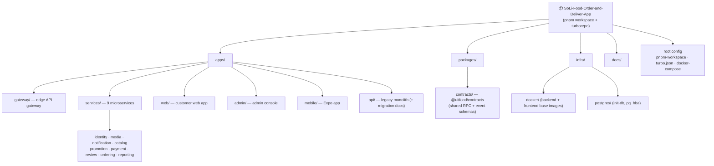
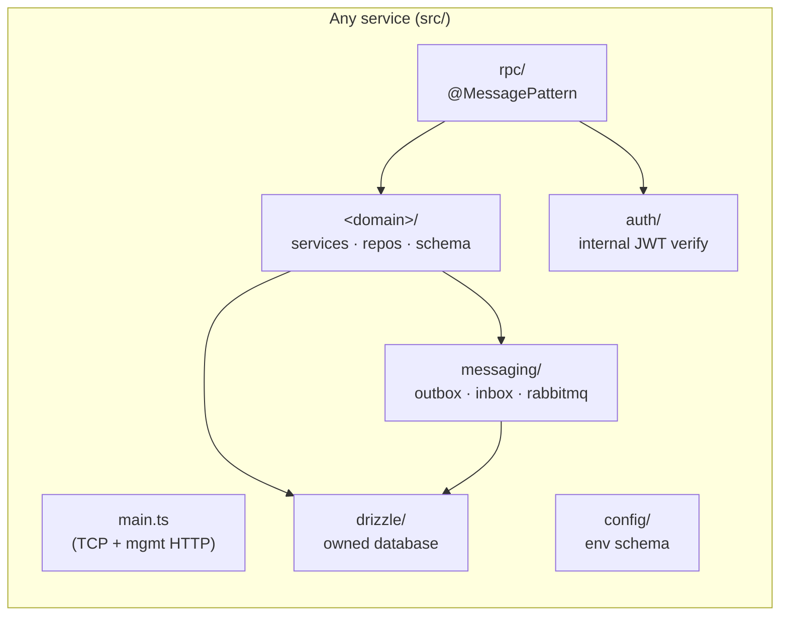

# UITFood — Project Structure

How the monorepo is laid out, why it's organized this way, and where to find
things. Pairs with [ARCHITECTURE.md](./ARCHITECTURE.md) (system shape) and
[TECHNICAL_SOLUTION.md](./TECHNICAL_SOLUTION.md) (tech stack).

It's a **pnpm + Turborepo monorepo**: many independently deployable apps and one
shared contracts package, in a single repository.

---

## 1. Top-level map



Everything runtime-related is under `apps/`; the one cross-cutting shared library
is `packages/contracts`; `infra/` holds Docker/Postgres bootstrap; deployment IaC
lives under a separate `infra/render` (Terraform).

---

## 2. Annotated directory tree

```text
SoLi-Food-Order-and-Deliver-App/
├── apps/
│   ├── gateway/                 # 🚪 Edge API gateway — the ONLY public ingress (:8080)
│   ├── services/                # 🧩 The 9 microservices (each independently deployable)
│   │   ├── identity/            #    users, sessions, roles (Better Auth)
│   │   ├── media/               #    image metadata + Cloudinary signing
│   │   ├── notification/        #    inbox, email, push, WebSocket
│   │   ├── catalog/             #    restaurants, menus, modifiers, zones, AI search
│   │   ├── promotion/           #    promotions, coupons, usage reservations
│   │   ├── payment/             #    VNPay attempts, IPN, refunds
│   │   ├── review/              #    reviews & ratings
│   │   ├── ordering/            #    carts, orders, lifecycle, history, ACL snapshots
│   │   └── reporting/           #    analytics projections (event-fed)
│   ├── web/                     # 💻 Customer web app (React + Vite)         :5173
│   ├── admin/                   # 🛠️  Admin console (React + Vite)            :5174
│   ├── mobile/                  # 📱 Mobile app (Expo / React Native)
│   └── api/                     # 🗄️  Legacy monolith (retained during cutover) + docs/PHASE_*_REPORT
│
├── packages/
│   └── contracts/               # 📜 @uitfood/contracts — shared RPC patterns + event/JWT schemas
│
├── infra/
│   ├── docker/                  # base dev images (backend + frontend)
│   ├── postgres/                # init-test-db.sql (per-service DBs), pg_hba.local.conf
│   └── render/                  # Terraform IaC (Render services + Postgres)
│
├── docs/                        # architecture, technical solution, ADRs, observability
│
├── docker-compose.dev.yml       # 🐳 local full-stack orchestration (all 16 containers)
├── pnpm-workspace.yaml          # workspace globs: apps/*, apps/services/*, packages/*
├── turbo.json                   # task graph + caching (build/typecheck/test/lint)
└── package.json                 # root scripts + tooling (turbo, prettier)
```

---

## 3. Anatomy of a service (the standard template)

Every one of the 9 services follows the **same internal shape** — so learning one
means you know them all. Using `promotion` as the clean template:

```text
apps/services/promotion/
├── src/
│   ├── main.ts                       # hybrid bootstrap: TCP microservice + management HTTP
│   ├── app.module.ts                 # root module — wires everything together
│   │
│   ├── config/
│   │   └── env.schema.ts             # Zod env validation (fail-fast at boot)
│   ├── auth/
│   │   ├── internal-auth.service.ts  # verify the gateway-issued internal JWT (aud check)
│   │   └── auth.module.ts
│   ├── drizzle/                      # database layer (owned DB)
│   │   ├── schema.ts                 # barrel of this service's tables
│   │   ├── database.module.ts        # Drizzle client + pooled pg connection
│   │   ├── database.constants.ts
│   │   └── out/                      # generated SQL migrations (+ meta journal)
│   ├── management/
│   │   └── management.controller.ts  # /live + /ready
│   ├── rpc/                          # the service's PUBLIC contract surface
│   │   ├── promotion-rpc.controller.ts   # @MessagePattern handlers
│   │   ├── promotion-rpc.errors.ts       # RPC → stable error envelope
│   │   └── rpc.module.ts
│   ├── shared/
│   │   └── ports/                    # interfaces (DIP) the domain depends on
│   └── promotion/                    # 👑 the DOMAIN (bounded context)
│       ├── promotion.module.ts
│       ├── domain/*.schema.ts        # table definitions
│       ├── services/*.ts             # business logic
│       ├── repositories/*.ts         # data access (Drizzle)
│       ├── engine/*.ts               # pure domain logic (pricing)
│       └── tasks/*.ts                # scheduled jobs (@Cron)
│
├── drizzle.config.ts                 # drizzle-kit migration config
├── Dockerfile / Dockerfile.dev       # prod multi-stage / dev image
├── tsconfig.json / tsconfig.test.json
├── nest-cli.json · eslint.config.mjs
└── package.json                      # service's own deps + scripts (dev/build/db:migrate/test)
```

### The recurring building blocks



Services that **produce or consume events** additionally have:

```text
src/messaging/
├── messaging.module.ts
├── rabbitmq/               # publisher + self-managed consumer (amqp-connection-manager)
├── inbox/                  # idempotent-consume dedupe
├── schema/                 # outbox_events / inbox_events tables
└── drizzle-executor.ts
src/<domain>/consumers/     # the projectors (e.g. reporting order/restaurant projections)
```

> **Naming intuition:** `rpc/` = what the service *offers* synchronously ·
> `messaging/consumers/` = what it *reacts to* asynchronously ·
> `<domain>/` = what it *is* · `drizzle/` = what it *owns*.

---

## 4. The gateway (`apps/gateway/src`)

The gateway mirrors the services: **one folder per downstream service**, each with
its HTTP controllers, TCP client, session guard, and CORS — plus shared plumbing.

```text
apps/gateway/src/
├── main.ts · app.module.ts · gateway.factory.ts   # bootstrap + middleware chain
├── config/            # env schema (service hosts/ports + *_ROUTES_ENABLED flags)
├── common/            # requestContext (strip trust headers, add x-request-id)
├── proxy/             # api-proxy.factory — Socket.IO passthrough / legacy fallback
├── health/            # /live, /ready (aggregates all services)
├── identity/          # session authenticator + internal-JWT minting (shared)
├── catalog/           # controllers → catalog TCP client
├── ordering/          # controllers → ordering TCP client
├── promotion/ · payment/ · review/ · reporting/   # …one per service
├── media/ · notification/
```

Each `<service>/` folder contains the same set: `*-routes.module.ts` (registered
behind the cutover flag), `*.controller.ts` (HTTP → TCP translation),
`nest-*-rpc.client.ts` (typed `ClientProxy` wrapper), `*-session.guard.ts`,
`*-cors.middleware.ts`, and `*.tokens.ts`.

---

## 5. The shared contracts package (`packages/contracts/src`)

The single source of truth for everything that crosses a service boundary.

```text
packages/contracts/src/
├── index.ts                # barrel — re-exports everything
├── envelope.ts             # the domain-event envelope (id, type, version, payload…)
├── event-names.ts          # every routing key (ordering.order.placed.v1, …)
├── internal-auth.ts        # mint/verify the internal JWT
├── events/                 # per-context event payload schemas (Zod)
│   ├── ordering.ts · catalog.ts · payment.ts · review.ts · identity.ts
├── catalog-rpc.ts          # CATALOG_RPC_PATTERNS + request/response schemas
├── ordering-rpc.ts · promotion-rpc.ts · payment-rpc.ts
├── review-rpc.ts · reporting-rpc.ts · identity.ts · media.ts · notification.ts
```

Because every service imports these, a change to a pattern or payload is a
**compile-time break** everywhere it's used — the contract can't silently drift.

---

## 6. Infrastructure & tooling

```text
infra/
├── docker/backend/Dockerfile.dev     # shared base image for all backend services
├── docker/frontend/Dockerfile.dev    # base image for web/admin
├── postgres/
│   ├── init-test-db.sql              # creates 1 DB + login role per service (fresh volume)
│   └── pg_hba.local.conf             # local auth rules
└── render/                           # Terraform: render_private_service + render_postgres per service

# Root
docker-compose.dev.yml                # the local fleet (postgres, redis×2, rabbitmq, backend-deps, 9 services, gateway, web, admin)
pnpm-workspace.yaml                   # apps/*, apps/services/*, packages/*
turbo.json                           # cached task pipeline
```

---

## 7. Quick reference — "where do I put / find…?"

| I want to… | Go to |
|---|---|
| Add/change a **public route** | `apps/gateway/src/<service>/` |
| Add a **service RPC** (offered capability) | `apps/services/<svc>/src/rpc/` |
| Change **business logic** | `apps/services/<svc>/src/<domain>/services/` |
| Change a **DB table / migration** | `apps/services/<svc>/src/<domain>/domain/*.schema.ts` → `pnpm --filter <svc> db:generate` |
| Add/consume an **event** | producer: `.../messaging/outbox` · consumer: `.../messaging/consumers/` |
| Change the **event/RPC contract** | `packages/contracts/src/` (then all services see the type change) |
| Change **env / config** | service: `src/config/env.schema.ts` + `.env` · gateway flags: `apps/gateway/src/config` |
| Change **local orchestration** | `docker-compose.dev.yml` |
| Change **DB provisioning** | `infra/postgres/init-test-db.sql` |
| Change **CI / deploy** | `.github/workflows/pipeline-<svc>.yml` · `infra/render/*.tf` |
| Read **why/how the migration happened** | `apps/api/docs/PHASE_*_REPORT.md`, `MICROSERVICES_MIGRATION_PLAN.md` |

---

## 8. Design principles the structure enforces

1. **One folder = one deployable unit.** Each `apps/services/<svc>` builds, tests,
   and ships on its own (`turbo prune --scope=<svc>`).
2. **Uniform service shape.** The same `config / auth / drizzle / rpc / messaging /
   <domain>` layout everywhere → low cognitive load across services.
3. **Contracts are centralized, implementations are not.** Types live once in
   `packages/contracts`; behavior lives in each service.
4. **The gateway is symmetric to the services.** One gateway folder per service
   keeps routing ownership obvious.
5. **Ownership is visible in the tree.** A service's database schema lives *inside*
   that service — you can't accidentally reach into another's data.
